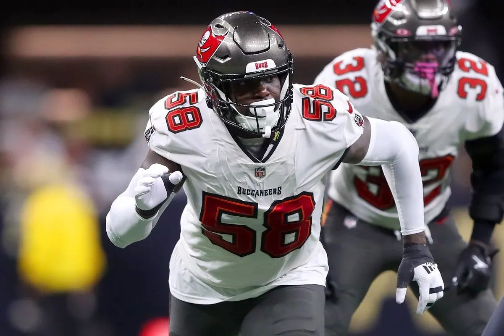

Former Pro-Bowl LB Shaq Barrett, who announced his retirement from the NFL in July, has applied to be reinstated to play immediately, per his agents Drew Rosenhaus and Robert Bailey. Barrett is coming out of retirement. The Dolphins currently hold Barrett’s contractual rights.

