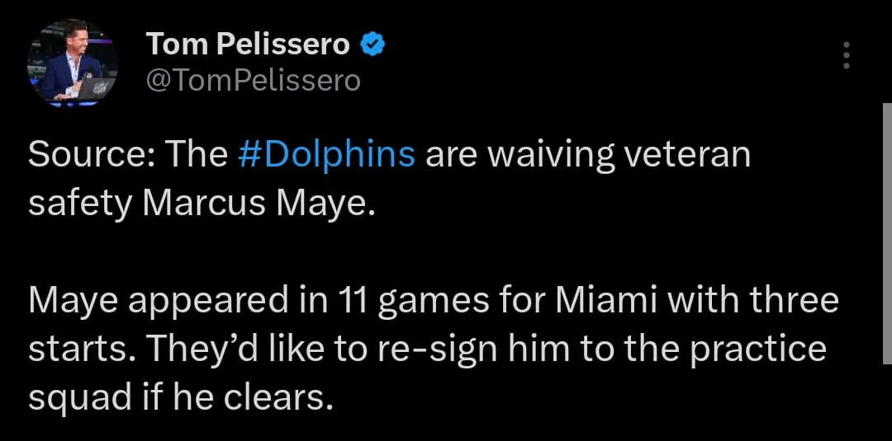

🚨 Movimientos al Roster 🚨

Los #Dolphins mandan a waivers al Safety Marcus Maye. 
3 titularidades, 11 apariciones este año con el equipo. 
Sorpresivo. No era el mejor Safety del equipo pero hay otras posiciones que tienen mucha profundidad o más de la necesaria y Maye no es tan malo como Poyer.

---

Eso abre un espacio en el roster que puede ser para Patrick McMorris que debe ser activado ya o de lo contrario debe pasar todo el año en IR.

Si libera Waivers, el equipo desea contratarlo para el Practice Squad.

#GoFins

