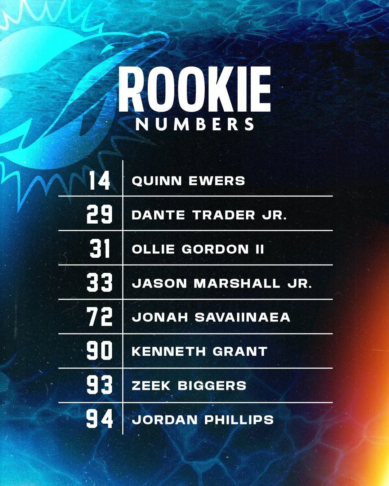

Miami Dolphins ya han firmado a 7 jugadores seleccionados en el draft: DT Kenneth Grant, DT Jordan Phillips, CB Jason Marshal Jr, S Dante Trader Jr, QB Quinn Ewers y DT Zeek Biggers. Todos ellos ya han elegido su número para el training camp

