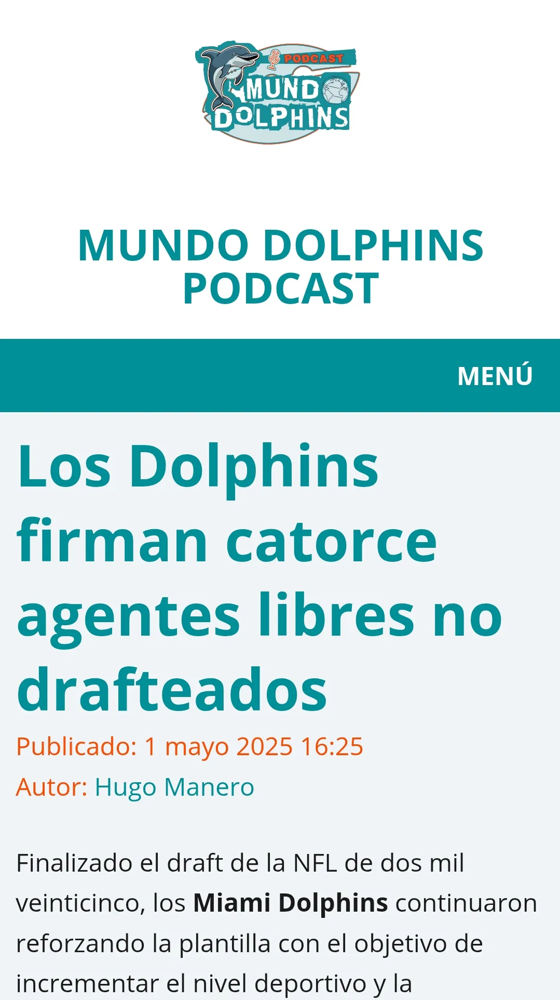

Seguimos añadiendo contenido en la web de @mundodolphins.es 
Analizamos la clase de agentes libres no drafteado firmados por Miami 
#PhinsUp
Enlace ⬇️ 
[mundodolphins.es/noticias/202...](https://mundodolphins.es/noticias/20250501-los-dolphins-firman-catorce-agentes-libres-no-drafteados/)

