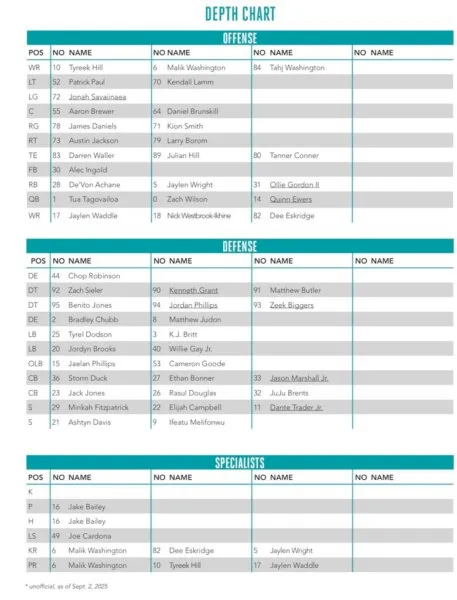

Primer depth chart de la temporada 2025 publicado de manera oficial, y nos encontramos algunas sorpresas: Wright sigue de RB2, y Ollie Gordon II de RB3, a pesar de la lesión del primero. Ashtyn Davis está por delante de Minkah Fitzpatrick. Y no hay ningún nickel cornerback titular

