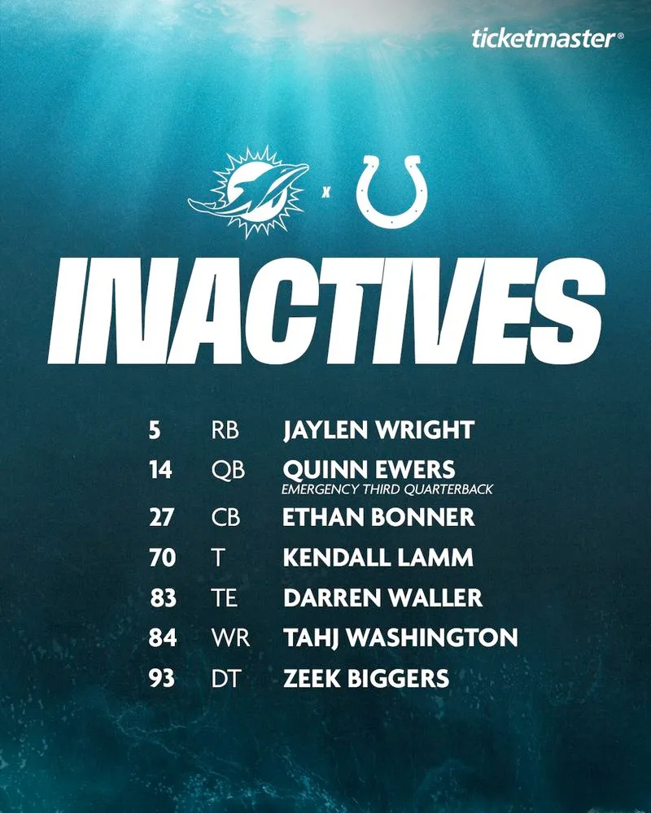

Tenemos la lista de jugadores inactivos para el partido de hoy contra Colts
QB Quinn Ewers (emergency quarterback), RB Jaylen Wright, CB Ethan Bonner, TE Darren Waller, OL Kendall Lamm, WR Tahj Washington y DT Zeek Biggers

