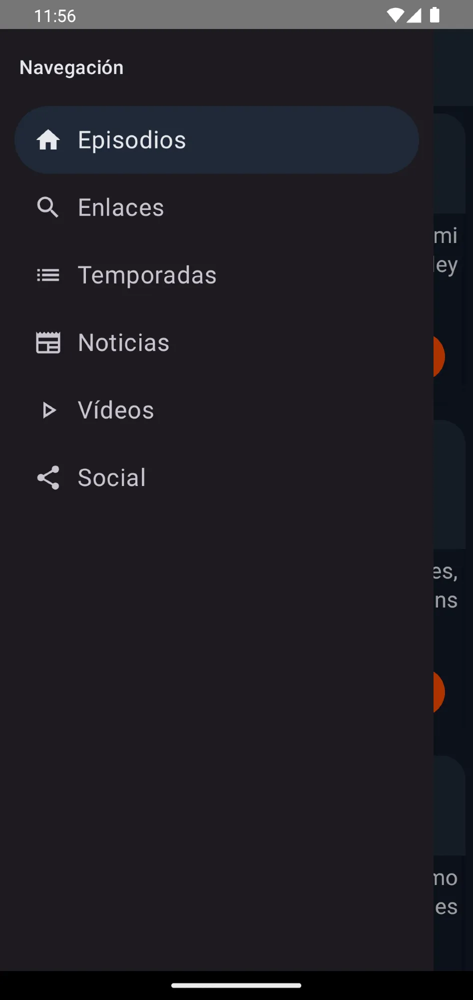
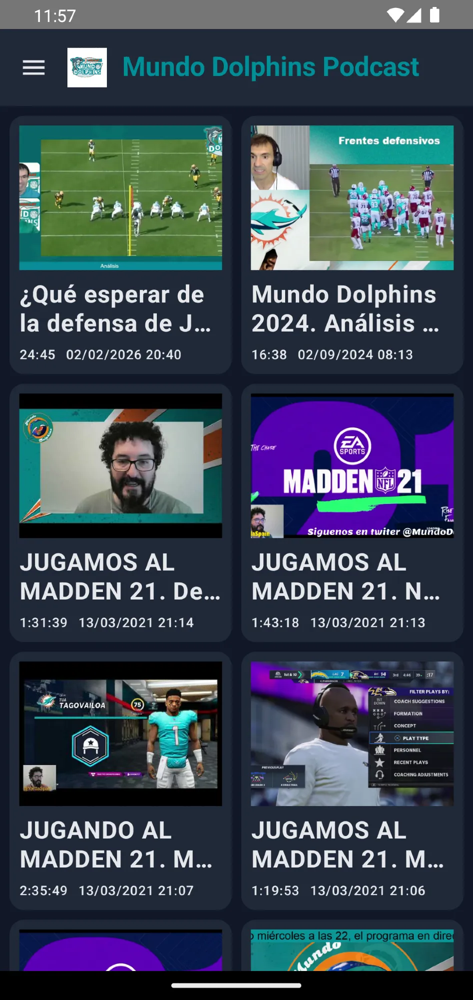
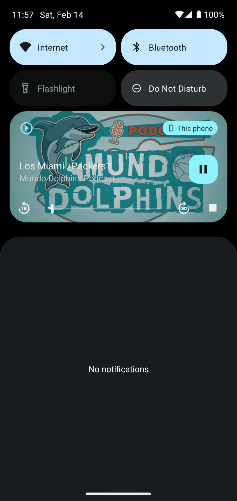

En estos días hemos dado un impulso a la app para Android de @mundodolphins.es 
Activado el modo oscuro
Mejorada la navegación
Secciones nuevas
Notificaciones de nuevo artículo y podcast
Mejoras en la visualización del texto
La puedes descargar gratis en [play.google.com/store/apps/d...](https://play.google.com/store/apps/details?id=es.mundodolphins.app)

---

Muchas gracias, lástima no disponer de más tiempo para darle más caña a la app. Para la web pronto tendré alguna sorpresa

