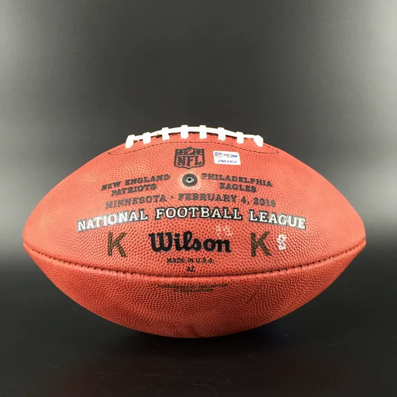

En la NFL los balones utilizados específicamente en jugadas de patada (kickoffs y field goals) tienen un nombre especial: K-Balls o “kicking balls”. Aunque son del mismo tamaño que los balones de juego, su manejo y preparación están estrictamente regulados por la liga.

---

Físicamente, un K-Ball es igual que cualquier balón oficial de la NFL: mismo tamaño, peso y presión. La liga exige que lleven una “K” marcada para identificarlos y que formen parte del protocolo de jugadas de patada.

---

En el rulebook oficial, se detallan las especificaciones del balón:
Longitud de 11–11¼ pulgadas
Circunferencia larga 28–28½ pulgadas
Circunferencia corta 21–21¼ pulgadas
Peso entre 14 y 15 oz
Presión entre 12.5 y 13.5 psi
Todo balón usado debe cumplir estos parámetros bajo revisión del árbitro.

---

Desde la temporada 2025 se implementó un protocolo nuevo para los K-Balls con el objetivo de mejorar el rendimiento y la consistencia de los pateadores. Anteriormente los balones llegaban prácticamente nuevos justo antes del partido, lo que dejaba poco tiempo de preparación.

---

• Cada equipo recibe al comienzo de la temporada una asignación de K-Balls (60)
• Pueden usarlos en prácticas para “ablandarlos” 
• Se permite frotarlos con cepillos y toallas húmedas para mejorar el agarre y flexibilidad, esto favorece que los kickers trabajen el balón con anticipación.

---

Previo a cada partido, los equipos deben presentar sus K-Balls a los árbitros. Los balones son inspeccionados y certificados, con una marca del árbitro en las costuras una vez aprobados. Además, cada K-Ball sólo puede usarse hasta en 3 partidos antes de retirarse de la rotación oficial.

---

En el pasado, algunos equipos usaban métodos extremos para modificar los K-Balls (saunas, calor, etc...), lo que llevó a la liga a reglamentar aún más la preparación con límites claros. El nuevo protocolo evita prácticas que alteren la forma o consistencia del balón.

---

Los cambios en la preparación y manejo de K-Balls han tenido un impacto real en el rendimiento de los pateadores, con distancias más largas y mayor consistencia en field goals, algo que ha varios entrenadores han destacado con comentarios en ruedas de prensa.

---

Aunque son técnicamente idénticos a los balones usados en el resto del juego, las K-Balls se manejan de forma distinta. A diferencia de los balones de juego, que pueden ser intercambiados si están mojados o dañados, los K-Balls pasan por este proceso de preparación específico.

---

Todo este protocolo busca un equilibrio muy preciso: permitir que los pateadores trabajen el balón y mejoren su rendimiento, pero evitando ventajas artificiales para cualquier equipo. Es una parte poco visible del juego, pero con un impacto creciente en el kicking game de la NFL.

