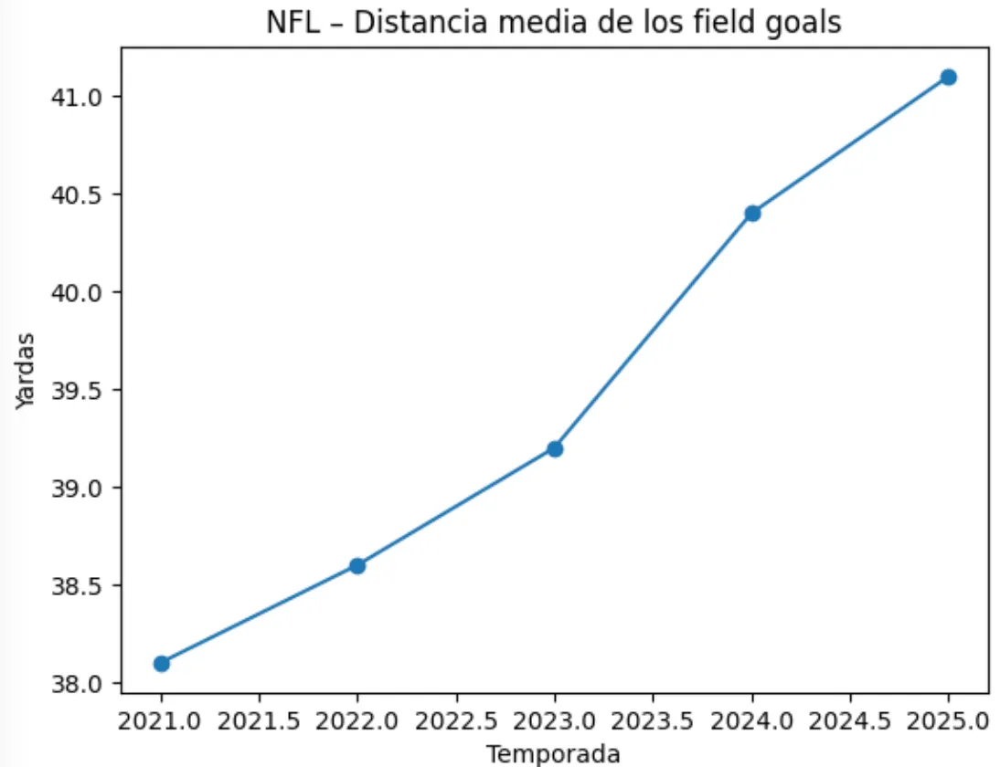
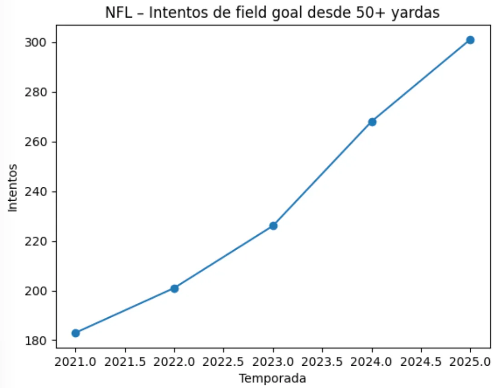
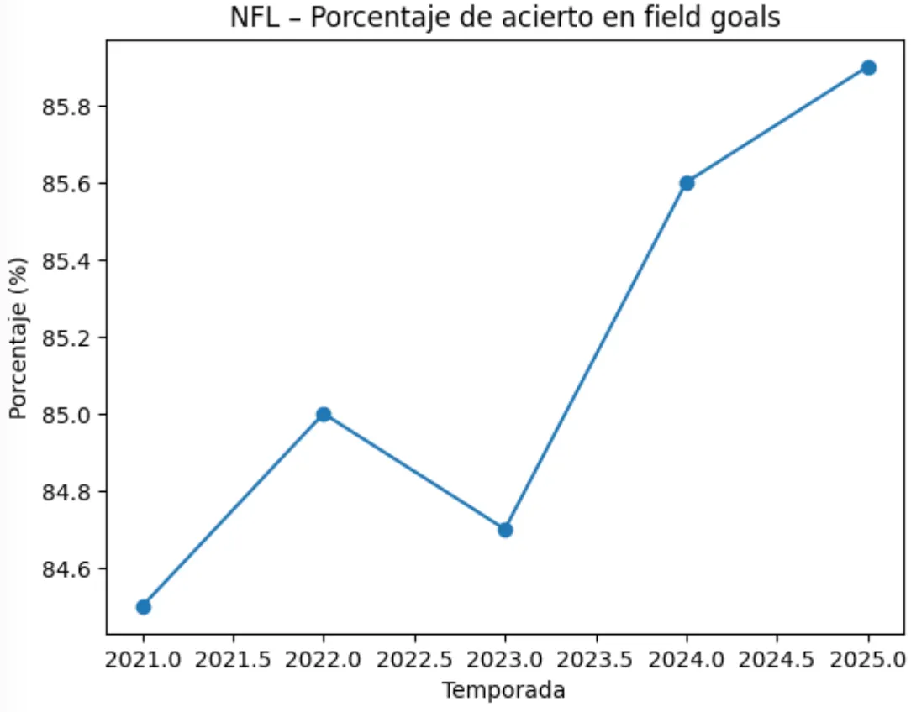

Para continuar el análisis de los equipos especiales, el field goal es probablemente la jugada que ha cambiado de forma más silenciosa en los últimos años, pero también una de las que más impacto tiene en la gestión del partido.

---

Entre 2021 y 2025 la NFL no sólo ha mantenido un volumen similar de FGs intentados, sino que ha modificado claramente desde dónde se patea.
La distancia media de los FGs ha aumentado de forma constante. Hoy se intentan patadas desde posiciones de campo que hace pocos años no se consideraban

---

El crecimiento más evidente está en los intentos desde más de 50 yardas. Cada temporada aumenta el volumen de patadas largas, hasta el punto de haberse normalizado dentro del planteamiento ofensivo.

---

Este cambio no se limita a finales de mitad o situaciones desesperadas. Muchos equipos consideran ya estas patadas como una opción real.
Este aumento de distancia no ha provocado una caída del porcentaje de acierto. La efectividad global de la liga se mantiene estable alrededor del 85 %.

---

Esto indica una mejora real en la técnica del kicker, en la ejecución del snap y el hold, en una jugada históricamente muy sensible al error.
Como consecuencia, la zona de FG se ha ampliado. Muchos ataques consideran patear en campo rival desde la yarda 45 o incluso más atrás.

---

Este cambio altera por completo la gestión de terceros y cuartos downs, así como las decisiones en finales de partido, donde el kicker ha ganado peso estratégico.
Sin necesidad de modificar reglas, la evolución técnica ha transformado el FG en una herramienta mucho más influyente dentro de la NFL.

