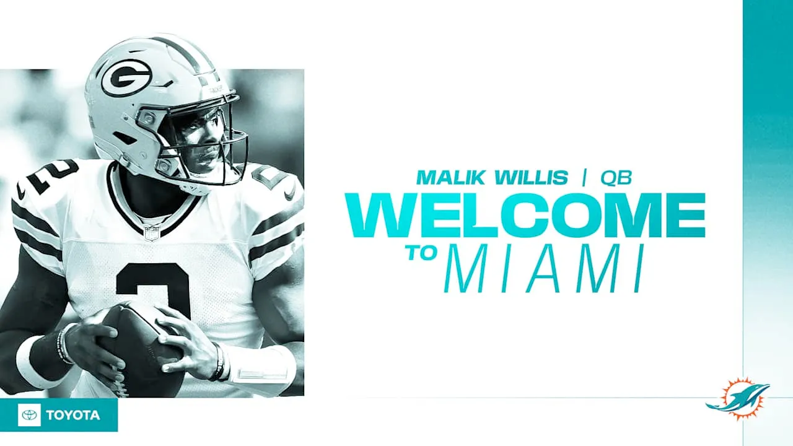
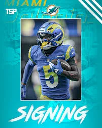
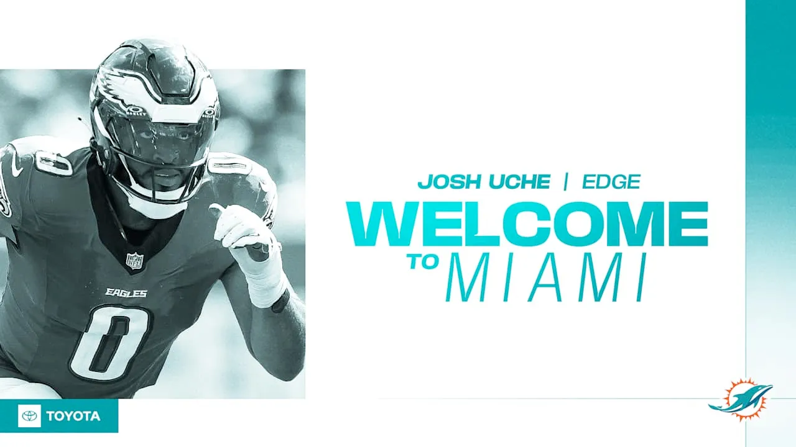
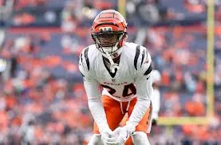
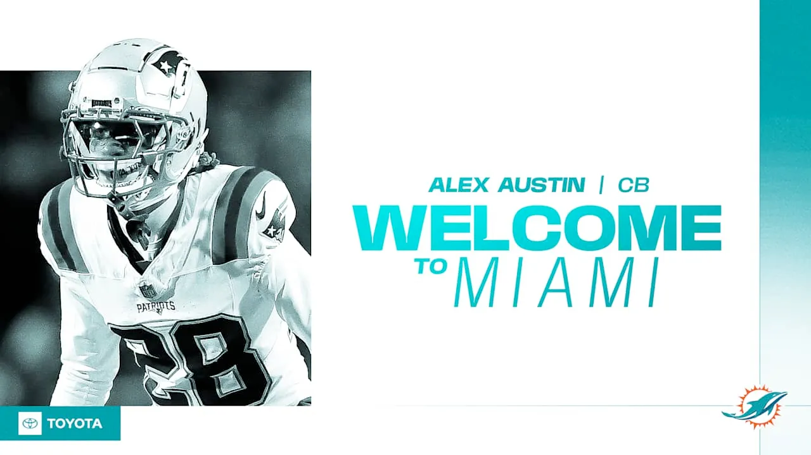
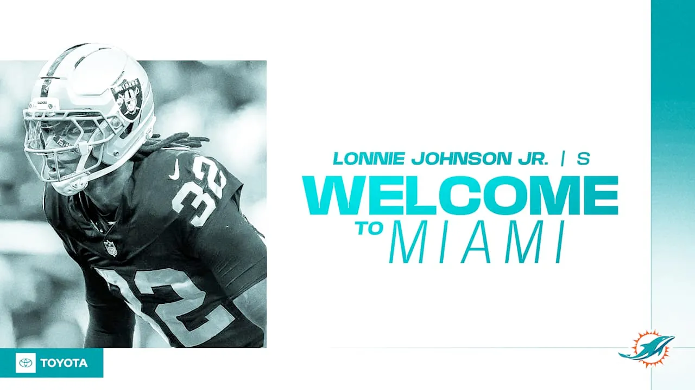
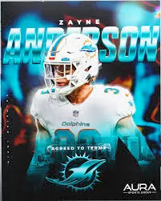
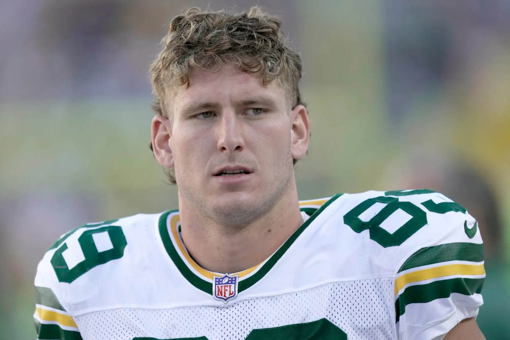
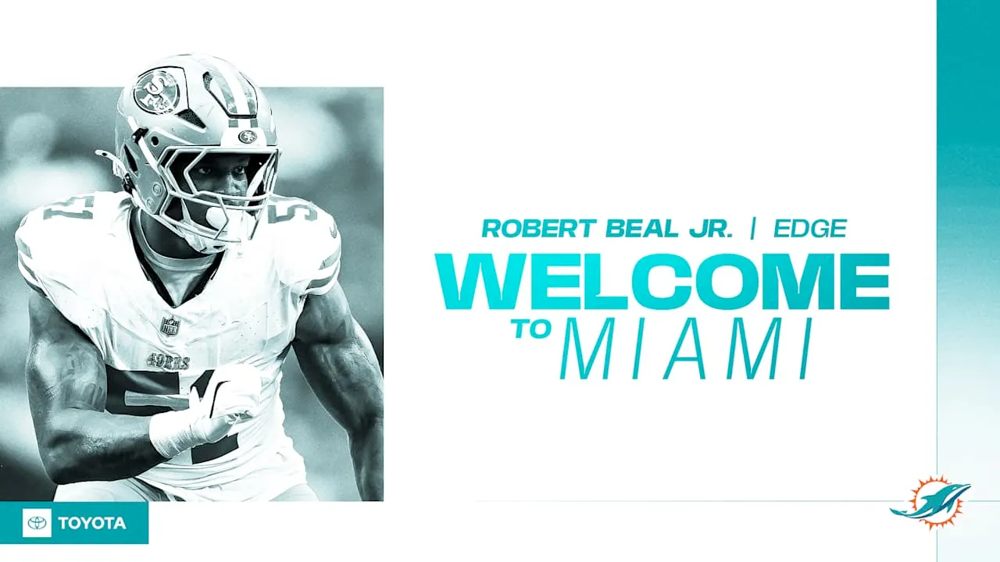
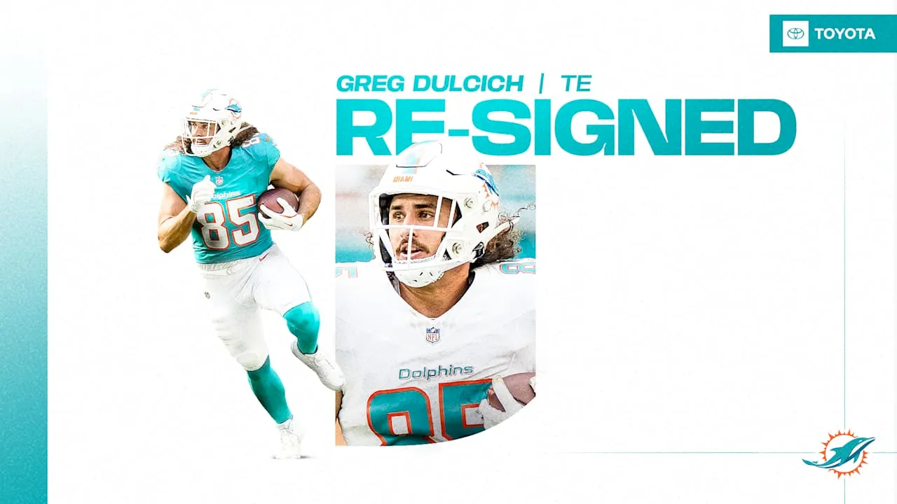

La agencia libre 2026 está en marcha y en este hilo vamos a repasar todos los movimientos de los Miami Dolphins en la offseason 2026: fichajes, renovaciones y salidas.

Jugador por jugador.

⬇️ Empezamos 👇

#Dolphins #NFLFreeAgency

---

Malik Willis — QB
Último equipo: Packers
Origen: Atlanta, Georgia 🇺🇸
College: Liberty

Contrato: 3 años — $67.5M
$45M garantizados

Miami apuesta por él como nuevo QB titular.

#Dolphins #NFLFreeAgency

---

Tutu Atwell — WR
Último equipo: Rams
Origen: Miami, Florida 🇺🇸
College: Louisville

Contrato: 1 año
Detalles no revelados

Velocidad para el ataque.

#Dolphins #NFLFreeAgency

---

Josh Uche — EDGE
Último equipo: Eagles
Origen: Miami, Florida 🇺🇸
College: Michigan

Contrato: 1 año

Refuerzo para el pass rush.

#Dolphins #NFLFreeAgency

---

Marco Wilson — CB
Último equipo: Bengals
Origen: Fort Lauderdale, Florida 🇺🇸
College: Florida

Contrato: 1 año (aprox.)

Profundidad en secundaria.

#Dolphins #NFLFreeAgency

---

Alex Austin — CB
Último equipo: Patriots
Origen: Long Beach, California 🇺🇸
College: Oregon State

Contrato: 1 año

Competencia para el roster defensivo.

#Dolphins #NFLFreeAgency

---

Lonnie Johnson Jr — DB
Último equipo: Raiders
Origen: Gary, Indiana 🇺🇸
College: Kentucky

Contrato: 1 año

Refuerzo para la secundaria.

#Dolphins #NFLFreeAgency

---

Zayne Anderson — S
Último equipo: Packers
Origen: Stansbury Park, Utah 🇺🇸
College: BYU

Contrato: 1 año

Aportará en equipos especiales.

#Dolphins #NFLFreeAgency

---

Ben Sims — TE
Último equipo: Packers
Origen: Tulsa, Oklahoma 🇺🇸
College: Baylor

Contrato: 1 año

Tight end de rotación.

#Dolphins #NFLFreeAgency

---

Robert Beal Jr — EDGE
Último equipo: Falcons
Origen: Lithonia, Georgia 🇺🇸
College: Georgia

Contrato: 1 año

Profundidad en la línea defensiva.

#Dolphins #NFLFreeAgency

---

Greg Dulcich — TE
Último equipo: Dolphins
Origen: Glendale, California 🇺🇸
College: UCLA

Contrato: 1 año
Detalles no revelados.

#Dolphins #NFLFreeAgency

