Miami sigue trabajando el pre-draft y ya han trascendido varios nombres de jugadores que han realizado o realizarán contactos con los Dolphins, ya sea en Top 30 visits, reuniones privadas o Pro Days. Repasamos quiénes son y qué perfil encaja en Miami. #Dolphins #NFLDraft

---

Makai Lemon — WR
Origen: Los Alamitos, California
College: USC
Datos combine/pro day: 5-11, 192 lb, 4.50 en las 40, split de 10 yardas de 1.59, brazos de 30 1/2”

Receptor explosivo y muy pulido en rutas cortas e intermedias. 
#Dolphins #NFLDraft 

[ras.football/ras-informat...](https://ras.football/ras-information/?PlayerID=29926&ovl=Southern+California)

---

K.C. Concepcion — WR
Origen: Charlotte, North Carolina
College: Texas A&M
Datos combine/pro day: 6-0, 196 lb, 4.46 en las 40, manos de 9 1/4”, brazos de 30 1/4”

Jugador muy versátil, con producción tanto como receptor como retornador. 
#Dolphins #NFLDraft 

[ras.football/ras-informat...](https://ras.football/ras-information/?PlayerID=29913&ovl=Texas+AM)

---

Mansoor Delane — CB
Origen: Silver Spring, Maryland
College: LSU
Datos combine/pro day: 6-0, 187 lb, 4.44 en las 40

Corner físico, atlético y con experiencia de alto nivel.
#Dolphins #NFLDraft 

[ras.football/ras-informat...](https://ras.football/ras-information/?PlayerID=30125&ovl=Louisiana+State)

---

Ted Hurst — WR
Origen: Savannah, Georgia
College: Georgia State
Datos combine: 6-4, 206 lb, 4.42 en las 40, split de 10 yardas de 1.55, vertical de 36.5”, broad jump de 135”

Perfil más grande y vertical que otros receptores vinculados a Miami. 
#Dolphins #NFLDraft 

[ras.football/ras-informat...](https://ras.football/ras-information/?PlayerID=29921&ovl=Georgia+State)

---

Denzel Boston — WR
Origen: South Hill, Washington
College: Washington
Datos combine/pro day: 6-4, 212 lb, 4.60 en las 40, shuttle de 4.28, vertical de 35”

Es un receptor grande, de balón dividido y presencia exterior.
#Dolphins #NFLDraft 

[ras.football/ras-informat...](https://ras.football/ras-information/?PlayerID=29905&ovl=Washington)

---

Jalon Kilgore — DB
Origen: Eatonton, Georgia
College: South Carolina
Datos combine: 6-1, 210 lb, 4.40 en las 40, split de 10 yardas de 1.56, vertical de 37”, broad jump de 130”, 16 reps de bench

Defensive back con físico NFL
#Dolphins #NFLDraft 

[ras.football/ras-informat...](https://ras.football/ras-information/?PlayerID=30141&ovl=South+Carolina)

---

Jake Pope — OT
Origen: Fort Lauderdale, Florida
College: Illinois State
Datos físicos reportados: 6-7, 300 lb

Jake Pope figura como contacto de Pro Day con Miami. Tackle de tamaño prototípico y además producto local de Florida
#Dolphins #NFLDraft

[ras.football/ras-informat...](https://ras.football/ras-information/?PlayerID=30586&ovl=Illinois+State)

---

Kayden McDonald — DT
Origen: Suwanee, Georgia
College: Ohio State
Datos combine: 6-2 1/8, 326 lb, brazos de 32 1/4”, manos de 9 3/4”, 5.04 en las 40, split de 10 yardas de 1.76, vertical de 32”, broad jump de 9’6”

Interior defensivo muy poderoso contra la carrera

#Dolphins #NFLDraft

---

Rueben Bain Jr. — EDGE
Origen: Miami, Florida
College: Miami
Datos combine: 6-2 1/4, 263 lb, brazos de 30 7/8”, manos de 9 1/8”. No realizó pruebas atléticas en el combine. 

Pass rusher muy potente, físico y técnico, con capacidad para ganar por manos y motor

#Dolphins #NFLDraft

---

Jordan Hudson — WR
Origen: Garland, Texas
College: SMU
Datos combine: 6-1, 191 lb, brazos de 31 1/8”, manos de 9 1/4”. No realizó pruebas atléticas en el combine. 

Receptor exterior con buen tamaño y capacidad para jugar por fuera.

#Dolphins #NFLDraft

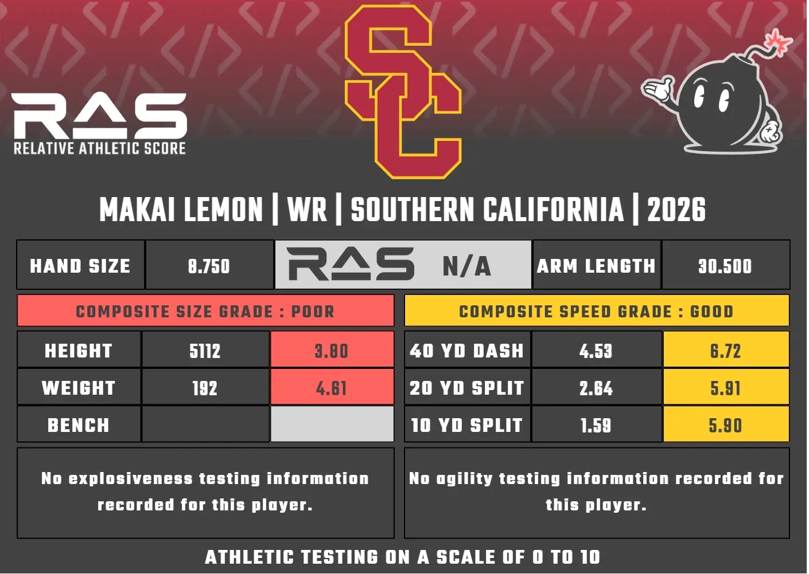

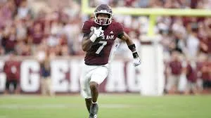

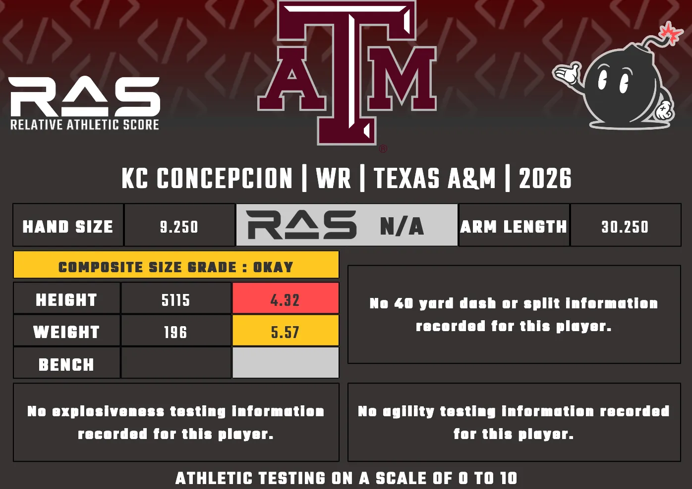

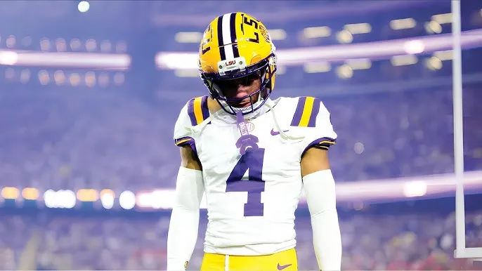

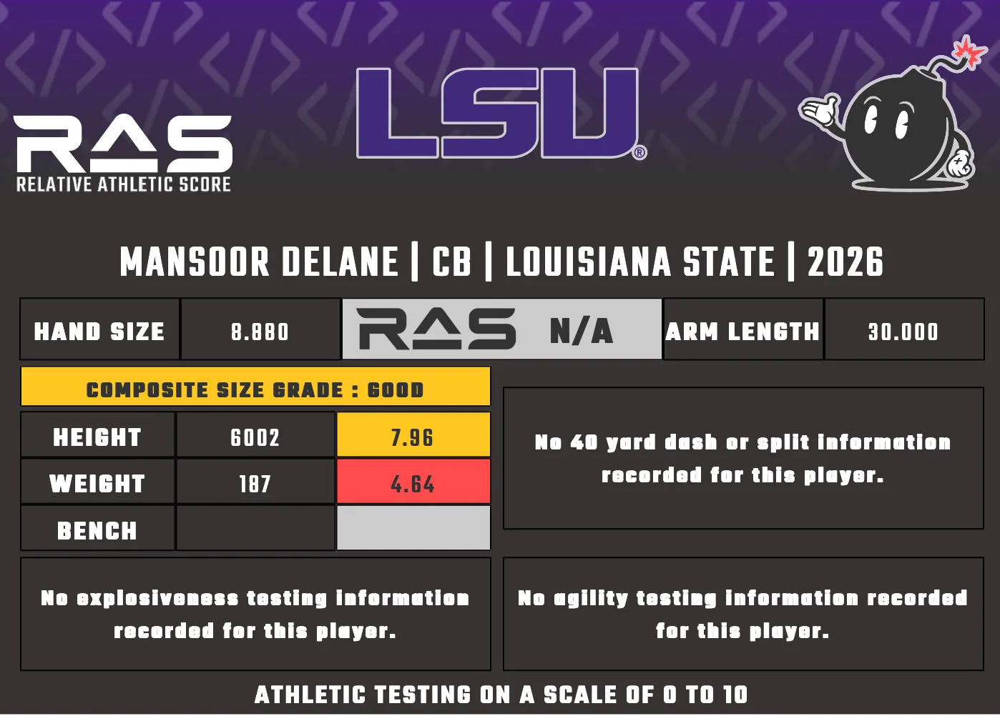

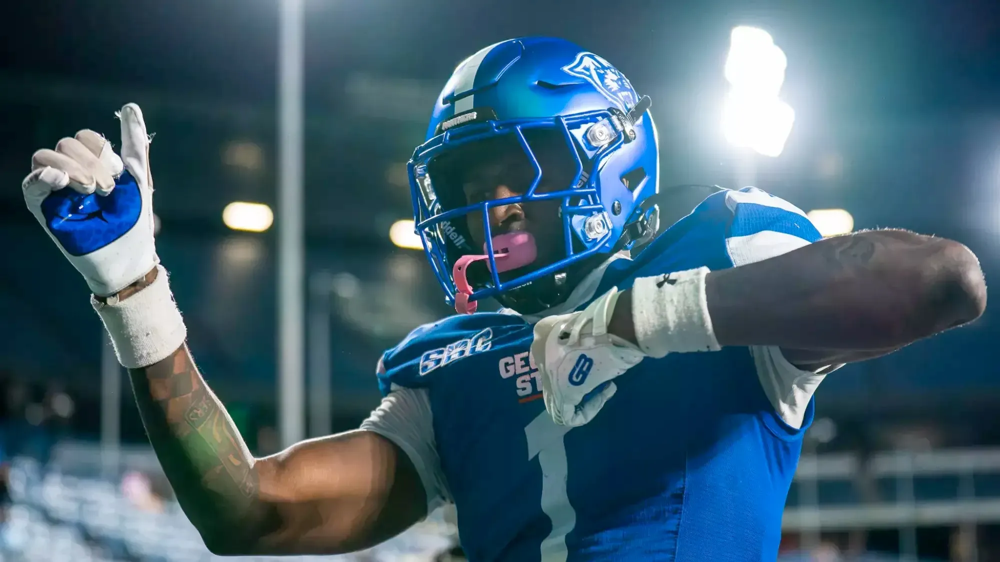

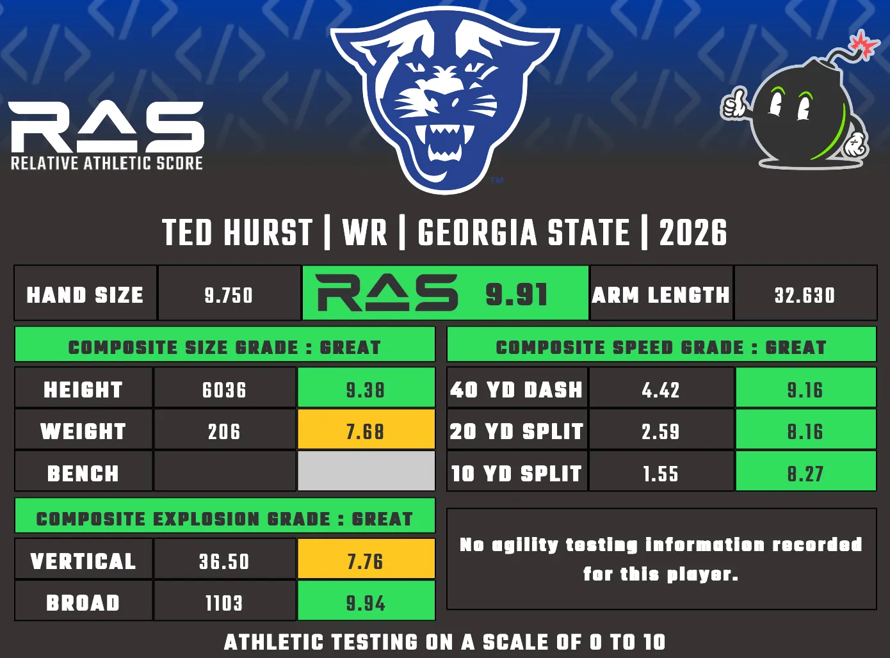

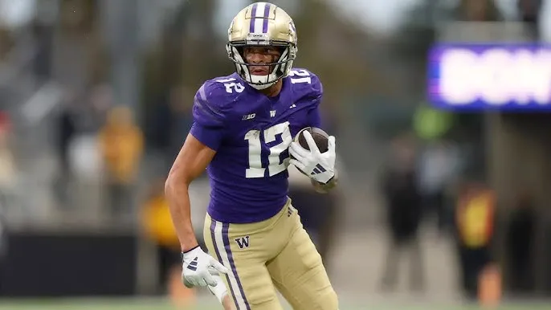

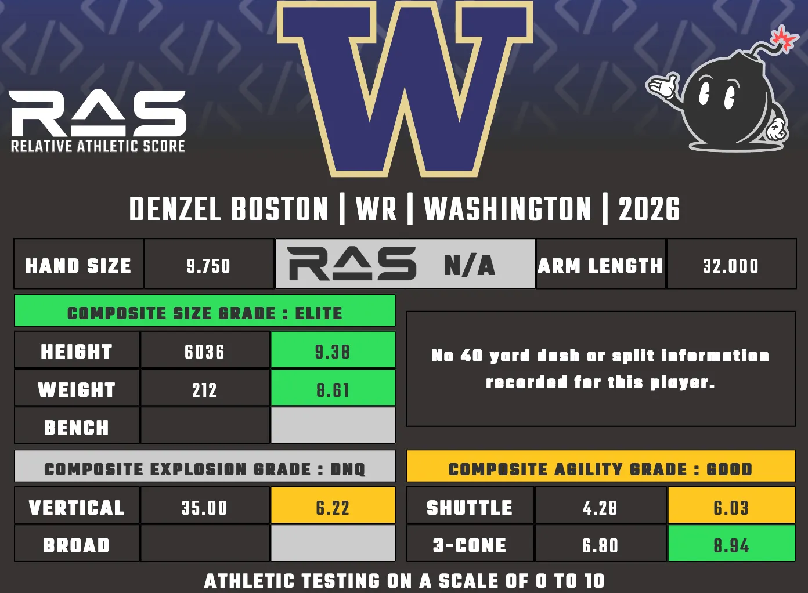

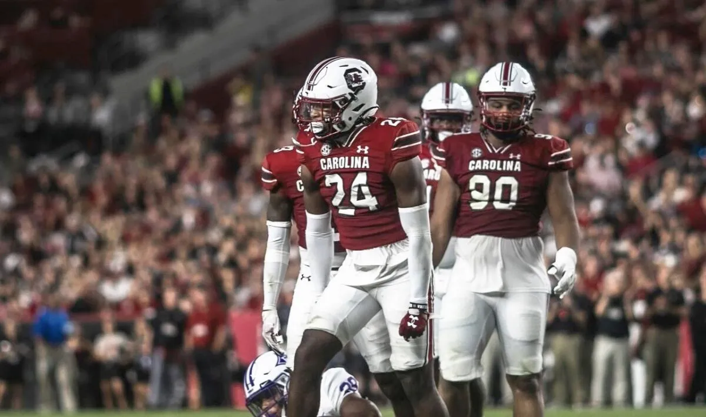

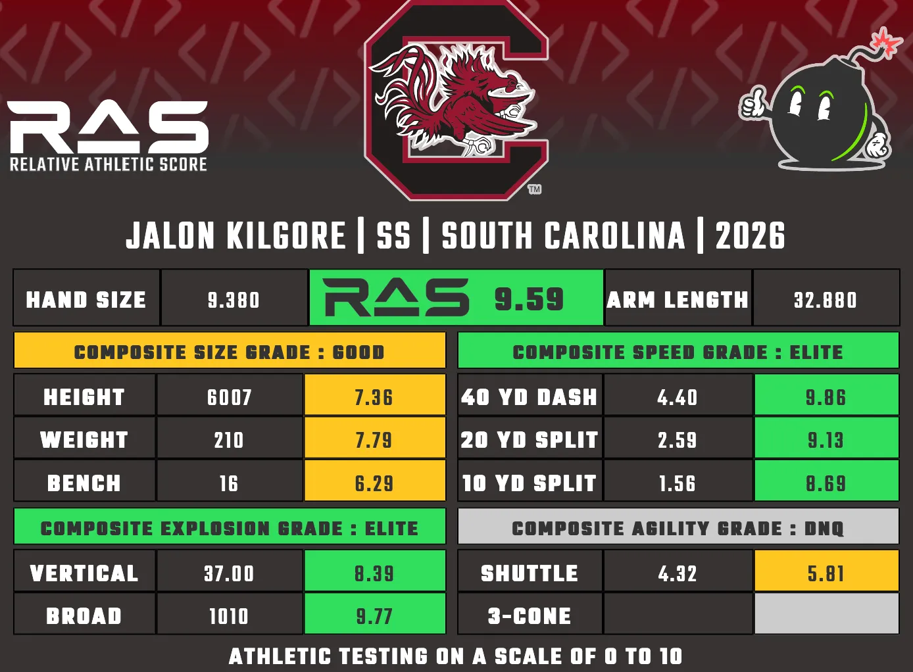

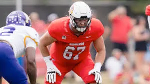

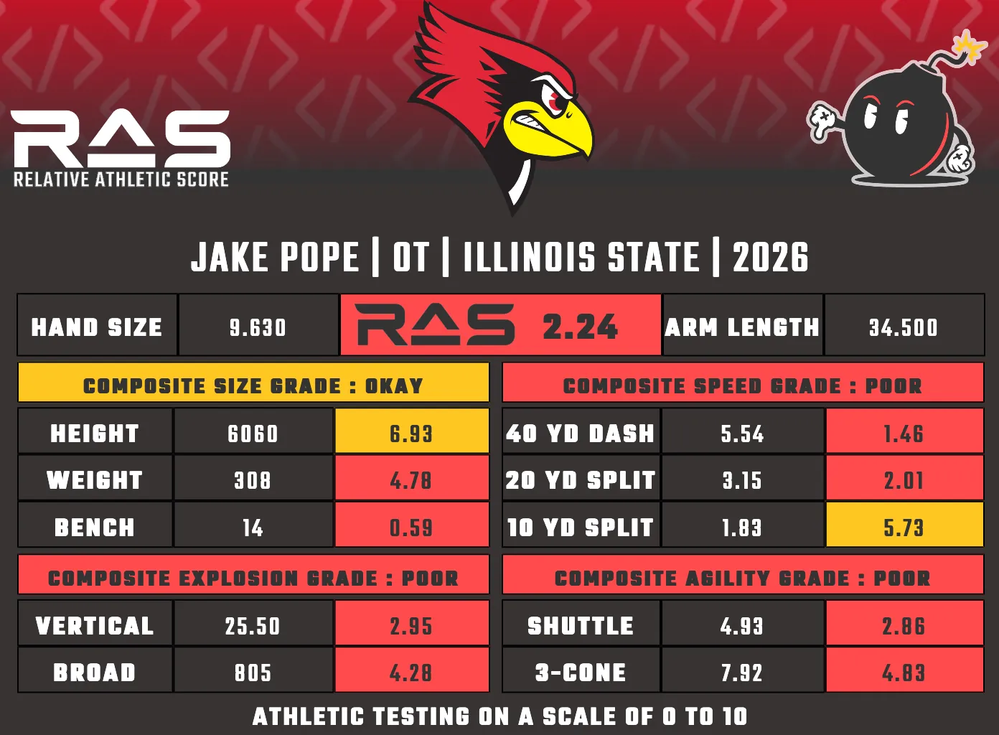

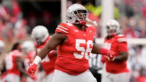

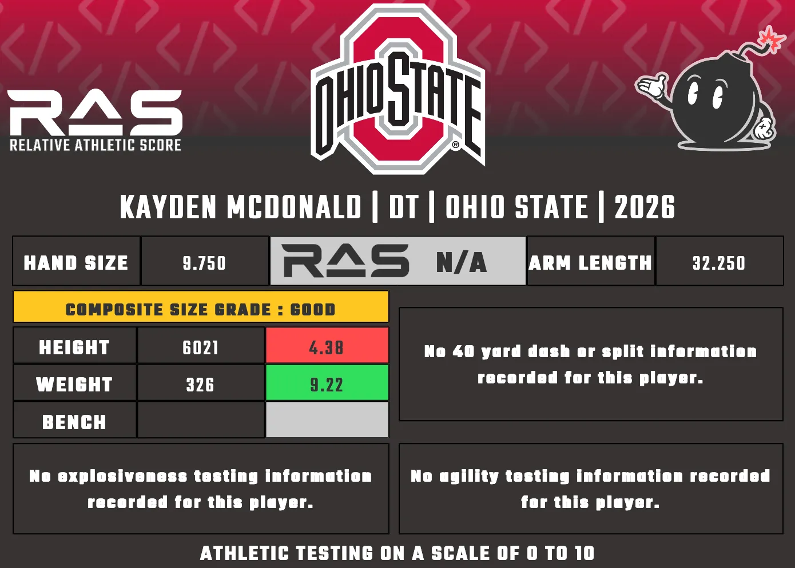

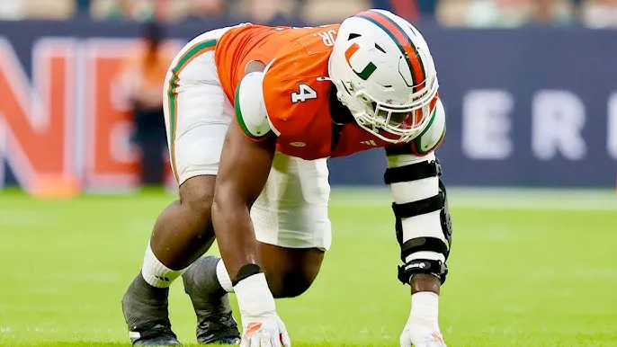

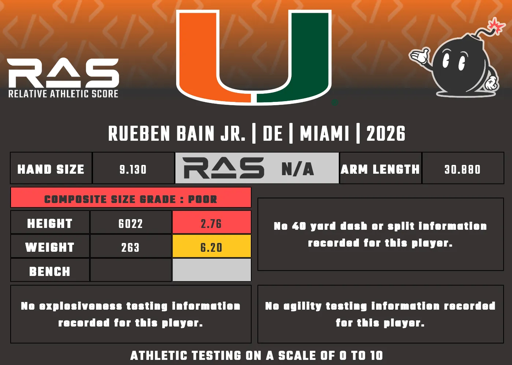

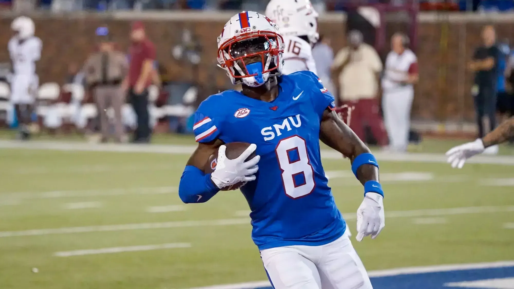

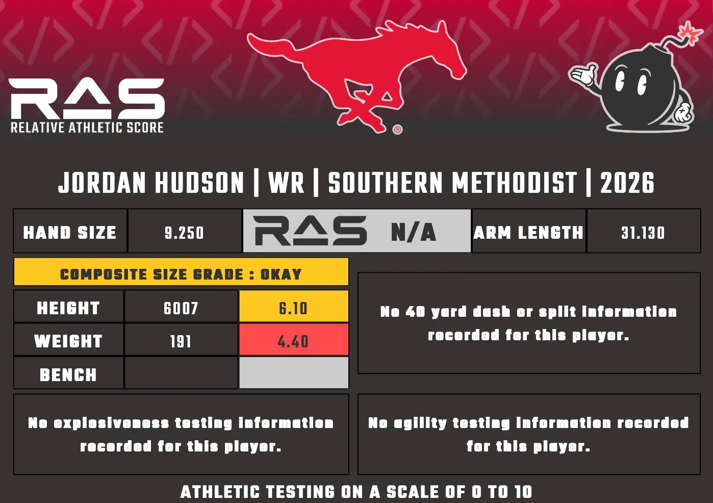
