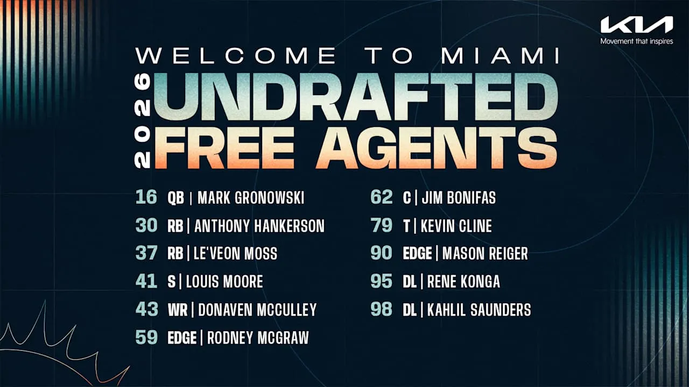

Miami ha hecho oficial el fichaje de 11 jugadores undrafted:
C Jim Bonifas, T Kevin Cline, QB Mark Gronowski, RB Anthony Hankerson, DL Rene Konga, WR Donaven McCulley, EDGE Rodney McGraw, S Louis Moore, RB Le'Veon Moss, EDGE Mason Reiger y DL Kahlil Saunders

