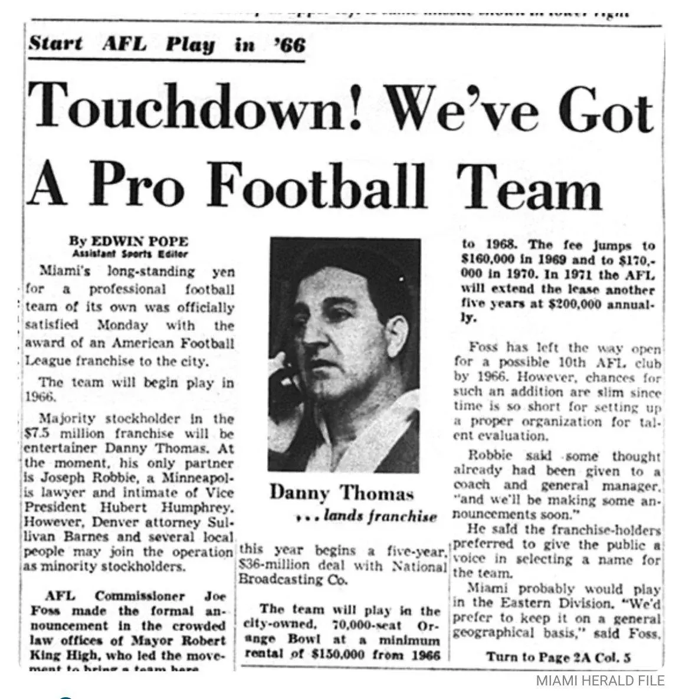

Efemérides: ayer 16 de agosto se cumplieron 61 años que la AFL otorgó la franquicia de expansión número nueve de la liga a Joseph Robbie y a Danny Thomas, por $7.5M. Oficialmente Miami tenía un equipo de football profesional

