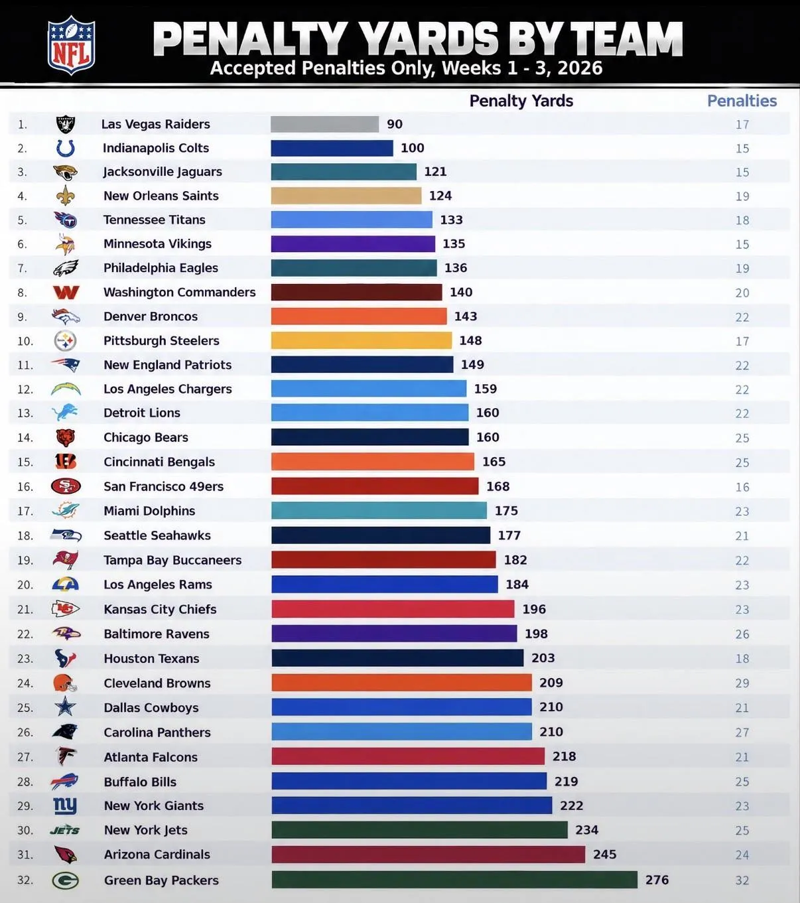

A pesar de la inexperiencia de una plantilla muy joven, Miami está justo en la zona media de la NFL en yardas por penalización: 175, 17º tras tres semanas. Y eso contando varios pañuelos bastante discutibles. Hay errores que corregir, sí, pero los números no reflejan un equipo indisciplinado.

