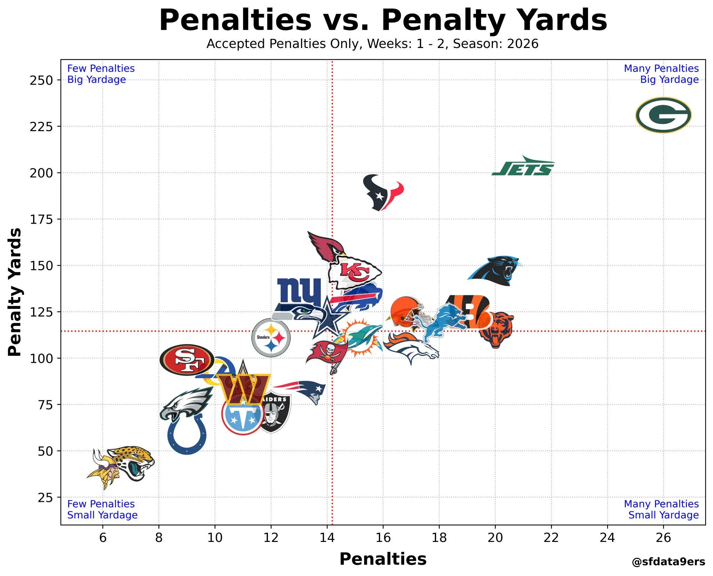

¿Cómo están los Dolphins en disciplina tras dos jornadas?

Miami acumula alrededor de 15 penalizaciones aceptadas y algo más de 105 yardas perdidas, unos números muy próximos a la media de la NFL.

Pero la gráfica permite ver bastante más

---

El eje horizontal representa el número de penalizaciones y el vertical las yardas perdidas por ellas.

Por eso, estar abajo y a la izquierda es lo más favorable: pocas penalizaciones y pocas yardas. Arriba y a la derecha se concentran los equipos más castigados.

---

Miami aparece prácticamente en el centro de la NFL.

Los Dolphins han cometido ligeramente más penalizaciones que la media, pero las yardas perdidas están por debajo de ella.

Es decir, por ahora el problema está más en la frecuencia que en castigos especialmente costosos.

---

El contraste entre equipos es considerable.

Green Bay aparece en el extremo superior derecho, con unas 26 penalizaciones y cerca de 230 yardas.

En el lado opuesto, Minnesota y Jacksonville están entre los equipos con menos castigos y menos yardas perdidas.

---

Como en la gráfica anterior, hay que tener en cuenta la muestra: únicamente se han disputado dos jornadas.

Además, aquí solo se contabilizan penalizaciones aceptadas, por lo que las declinadas o anuladas no forman parte de los datos.

Otra gráfica gracias a @sfdata9ers.bsky.social

