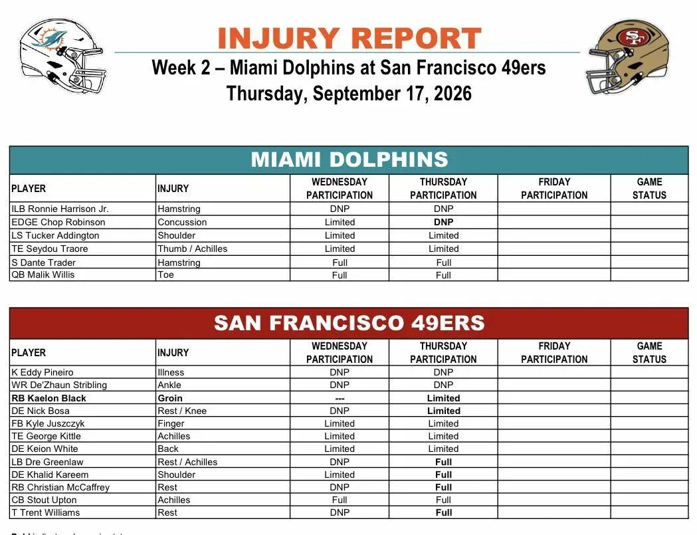

El injury report del jueves deja noticias importantes antes del Dolphins–49ers. Y quizá la más preocupante para Miami sea la evolución de Chop Robinson.
El EDGE pasó de entrenar limitado el miércoles a no participar el jueves por la conmoción cerebral.

---

Es un paso atrás importante.
Chop continúa en el protocolo de conmociones y el jueves se limitó a observar el entrenamiento acompañado por un preparador. Su disponibilidad para el domingo queda ahora como una de las grandes incógnitas de Miami.

---

Y no es la única preocupación defensiva.
Ronnie Harrison tampoco entrenó por segundo día consecutivo debido a una lesión en el isquiotibial.
Con Kyle Louis ya fuera por su lesión de rodilla, Miami podría volver a tener que reajustar piezas en defensa.

---

Las mejores noticias llegan en ataque y en la secundaria.
Malik Willis, pese a aparecer en el injury report por un problema en un dedo del pie, volvió a entrenar con normalidad.
Dante Trader Jr. también completó toda la sesión por segundo día consecutivo.

---

Tucker Addington continúa limitado por su hombro, mientras que Seydou Traore volvió a trabajar de forma parcial por sus problemas en pulgar y Aquiles.
Así que, dentro de las dudas de Miami, ninguna ha evolucionado peor entre miércoles y jueves que la de Chop Robinson.

---

En San Francisco ocurre casi lo contrario: varios pesos pesados que descansaron el miércoles regresaron.
Christian McCaffrey, Dre Greenlaw y Trent Williams completaron el entrenamiento del jueves, despejando buena parte de las dudas que podía dejar el primer injury report.

---

Nick Bosa también volvió al campo, aunque de forma limitada por descanso y molestias en la rodilla.
George Kittle siguió limitado por el Aquiles y Kyle Juszczyk por un dedo, mientras Keion White también trabajó parcialmente por una lesión de espalda.

---

Pero apareció una novedad: Kaelon Black fue añadido al injury report por molestias en la ingle y entrenó limitado.
Shanahan explicó que sintió tirantez y prefirieron no forzarle. El rookie venía de correr 14 veces para 65 yardas ante los Rams.

---

Así llegamos al viernes con dos situaciones especialmente interesantes que vigilar.
Miami necesita saber si Chop Robinson puede avanzar en el protocolo de conmociones; San Francisco comprobará la evolución de Kittle, Bosa y la nueva lesión de Kaelon Black.

