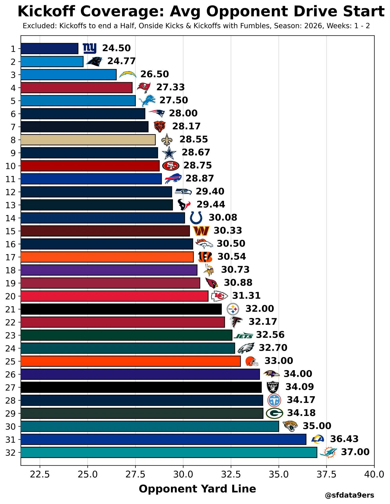

Hay un dato de los special teams de Miami que destaca después de las dos primeras jornadas.

Los Dolphins son el equipo que está permitiendo al rival comenzar sus drives en mejor posición de campo después de los kickoffs: yarda 37 de media.

---

¿Qué mide exactamente la gráfica?

La posición media desde la que el rival inicia su siguiente posesión después de un kickoff.

Cuanto menor sea la cifra, mejor ha funcionado la combinación de kickoff y cobertura. Giants lidera la NFL permitiendo empezar desde la yarda 24.5.

---

Miami aparece justo en el extremo contrario.

Los rivales de los Dolphins están comenzando de media desde su propia yarda 37, último puesto de la NFL.

El siguiente peor registro es Rams con 36.43, mientras Jacksonville está en 35.00.

---

Es importante poner el dato en contexto: solo incluye las semanas 1 y 2, por lo que la muestra todavía es muy reducida.

Además, la estadística excluye kickoffs al final de una mitad, onside kicks y jugadas en las que se produjo un fumble.

Gráfica de @sfdata9ers.bsky.social

