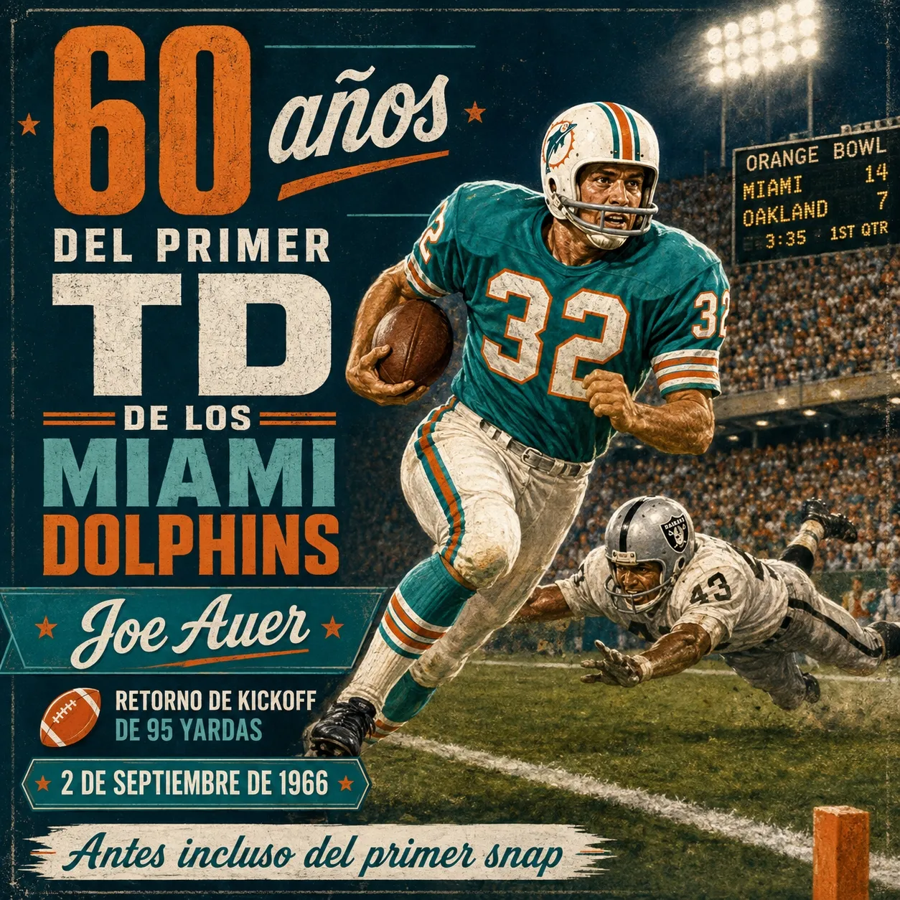

Hoy hace exactamente 60 años comenzó la historia de los Miami Dolphins.

2 de septiembre de 1966. Kickoff inicial. Joe Auer recibe en la yarda 5 y recorre 95 yardas hasta la end zone.

Miami aún no había jugado un solo snap ofensivo.

La historia completa 👇
[mundodolphins.es/noticias/202...](https://mundodolphins.es/noticias/20260822-antes-incluso-del-primer-snap-joe-auer-y-las-95-yardas-que-inauguraron-a-los-miami-dolphins/)

