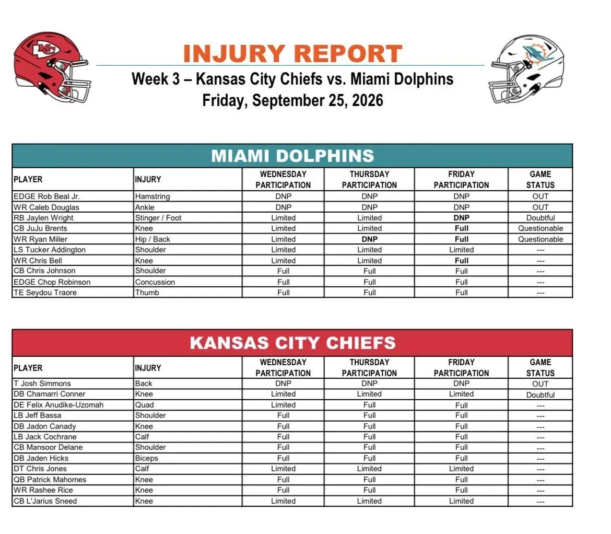

Injury report final para el Dolphins–Chiefs.
Miami pierde definitivamente a Rob Beal Jr. y Caleb Douglas, mientras Jaylen Wright termina la semana como Doubtful. JuJu Brents y Ryan Miller son Questionable.
Repasamos todo

---

Rob Beal Jr. (hamstring) y Caleb Douglas (tobillo) no entrenaron en toda la semana y están oficialmente OUT.
Miami tendrá que afrontar el partido sin dos jugadores que tampoco pudieron participar ni miércoles, ni jueves, ni viernes.

---

La otra mala noticia es Jaylen Wright.
El RB había estado limitado miércoles y jueves por un stinger/problema en el pie, pero no entrenó el viernes y queda como Doubtful para el domingo.
Su participación parece complicada.

---

JuJu Brents ofrece una evolución más positiva.
El CB pasó de estar limitado miércoles y jueves a entrenar completamente el viernes, aunque Miami lo mantiene como Questionable por su rodilla.
Ryan Miller también es Questionable tras volver a trabajar al completo.

---

Chris Bell también progresó hasta participación completa el viernes y no tiene designación para el partido.
Tucker Addington siguió limitado, mientras Chris Johnson, Chop Robinson y Seydou Traore completaron las tres sesiones de la semana sin restricciones finales.

---

Especialmente importante el caso de Chop Robinson.
El EDGE aparece todavía en el informe por la conmoción, pero entrenó completamente miércoles, jueves y viernes y termina la semana sin designación para el partido.
Miami recupera así una pieza importante para el pass rush.

---

Kansas City tendrá una baja confirmada: Josh Simmons está OUT por su lesión de espalda tras no entrenar en toda la semana.
Además, Chamarri Conner termina como Doubtful después de participar de forma limitada en las tres sesiones.

---

Chris Jones y L'Jarius Sneed estuvieron limitados durante toda la semana, pero ninguno recibe designación para el partido.
Patrick Mahomes y Rashee Rice, ambos incluidos por problemas de rodilla, entrenaron completamente los tres días y tampoco tienen estatus de lesión.

---

Así queda lo más importante antes del domingo:
OUT: Beal Jr., Caleb Douglas
Doubtful: Jaylen Wright
Questionable: JuJu Brents, Ryan Miller
KC
OUT: Josh Simmons
Doubtful: Chamarri Conner
El resto termina la semana sin designación.

