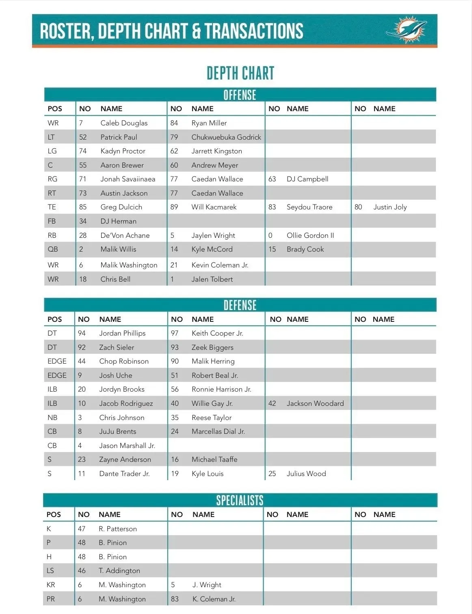

Los Dolphins han publicado un nuevo depth chart NO OFICIAL para la Week 1 ante Las Vegas.
Y deja varias novedades interesantes a pocos días del estreno: rookies ganando puestos, cambios en WR y una pista sobre cómo podría utilizar Miami a Kyle Louis.

---

La primera sorpresa está en WR.
Caleb Douglas, Malik Washington y el rookie Chris Bell aparecen en la primera línea, mientras que Jalen Tolbert figura ahora por detrás de Bell.
Kevin Coleman Jr. queda como segundo de Washington.

---

La juventud del equipo queda especialmente clara: 6 rookies aparecen entre los titulares y, sin contar equipos especiales, 13 titulares tienen tres temporadas o menos de experiencia NFL.
Cinco de las seis primeras elecciones de Miami en el Draft aparecen ya como titulares.

---

En defensa, Jacob Rodriguez figura junto a Jordyn Brooks como ILB titular.
También destaca la secundaria: Zayne Anderson aparece por delante de Michael Taaffe y Dante Trader Jr. mantiene la otra plaza de safety.
Pero hay otra novedad interesante

---

Kyle Louis, elegido como LB, aparece ahora en el depth chart como SAFETY, por detrás de Dante Trader Jr.
No significa necesariamente un cambio definitivo de posición, pero encaja con su perfil híbrido y abre la posibilidad de verlo en paquetes con varios safeties/big nickel.

---

El resto dibuja bastante bien la base que Miami llevará a Las Vegas:
Willis QB1; McCord QB2
Achane–Wright–Gordon
Chop Robinson y Josh Uche en EDGE
Brents y Jason Marshall Jr. en CB
Malik Washington como KR y PR
Es un depth chart NO OFICIAL y no garantiza el reparto de snaps del domingo

