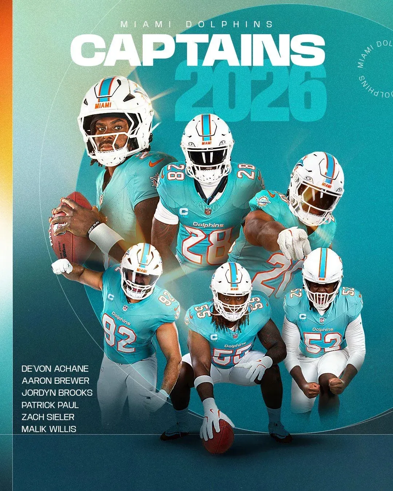

Los Dolphins ya tienen capitanes para 2026. Elegidos por votación del vestuario:

Malik Willis
De’Von Achane
Aaron Brewer
Patrick Paul
Zach Sieler
Jordyn Brooks

Seis líderes para la primera temporada de Jeff Hafley en Miami.

