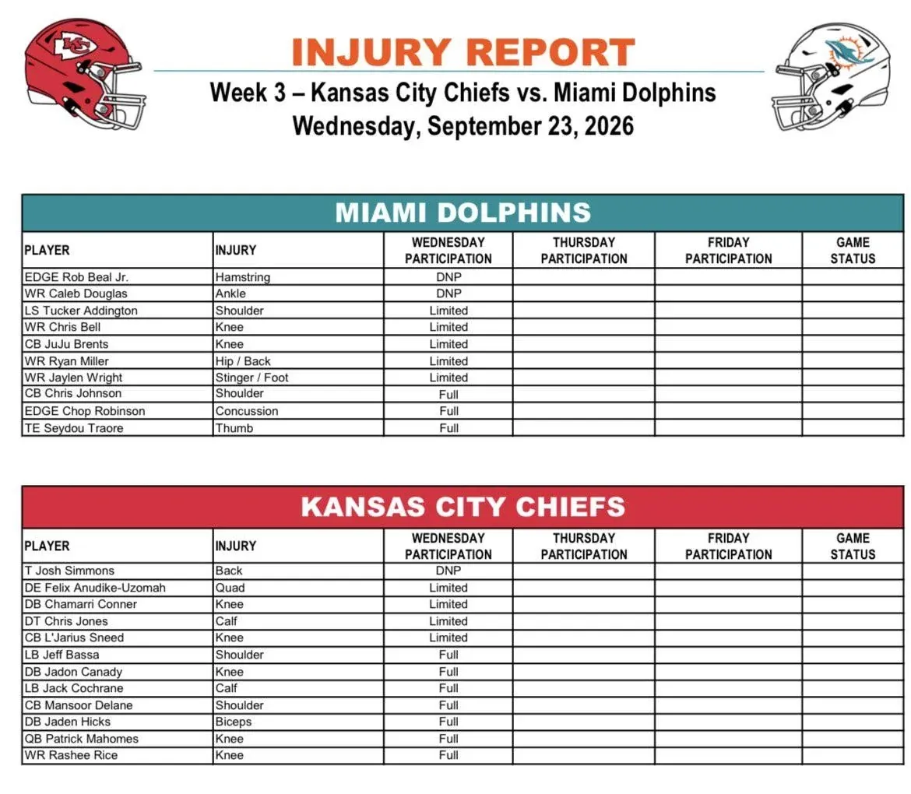

Primer injury report de la semana para Dolphins-Chiefs. Miami tuvo dos ausencias el miércoles: EDGE Rob Beal Jr. (isquiotibiales) y WR Caleb Douglas (tobillo). El resto de jugadores incluidos pudo participar, aunque varios de forma limitada.

---

Entre los limitados de Miami estuvieron LS Tucker Addington (hombro), WR Chris Bell (rodilla), CB JuJu Brents (rodilla), WR Ryan Miller (cadera/espalda) y WR Jaylen Wright (stinger/pie). Chris Johnson, Chop Robinson y Seydou Traore participaron por completo.

---

En Kansas City, T Josh Simmons (espalda) fue el único jugador que no entrenó. Felix Anudike-Uzomah, Chamari Conner, Chris Jones y L’Jarius Sneed trabajaron de forma limitada. El resto de los jugadores incluidos participó por completo.

---

Entre los participantes completos de los Chiefs aparecen Patrick Mahomes (rodilla) y Rashee Rice (rodilla), además de Jeff Bassa, Jadon Canady, Jack Cochrane, Mansoor Delane y Jaden Hicks. El jueves tendremos una nueva actualización de ambos equipos.

