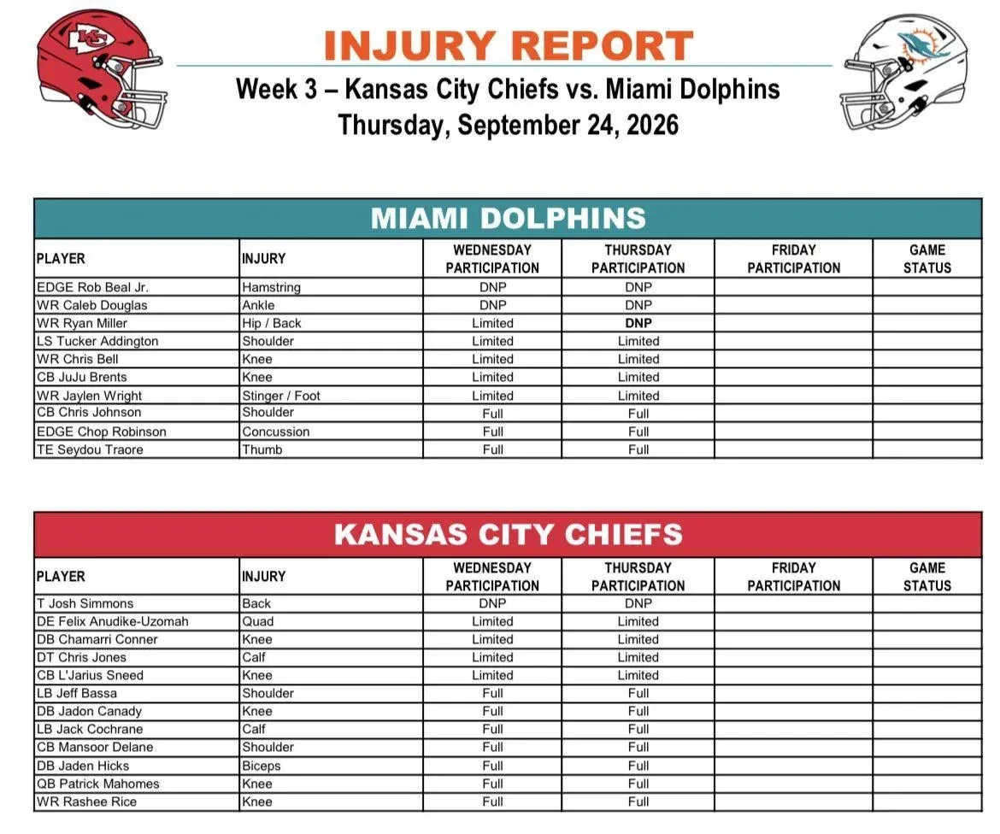

Segundo injury report de la semana antes del Dolphins–Chiefs.
Miami mantiene varias ausencias importantes y aparece una novedad negativa: Ryan Miller pasa de participación limitada el miércoles a no entrenar el jueves.
Repasamos la situación

---

Rob Beal Jr. sigue sin entrenar por la lesión de corva y Caleb Douglas tampoco ha podido participar ninguno de los dos días por su problema de tobillo.
Ambos llegan al viernes sin haber realizado todavía una práctica esta semana.

---

La principal novedad del jueves es Ryan Miller. El WR había trabajado de forma limitada el miércoles por molestias en cadera y espalda, pero hoy figura como DNP.
Su evolución en la última sesión de la semana será uno de los puntos a seguir.

---

Otros cuatro jugadores de Miami mantienen participación limitada por segundo día consecutivo: Tucker Addington (hombro), Chris Bell (rodilla), JuJu Brents (rodilla) y Jaylen Wright (stinger/pie).
Ninguno ha sufrido cambios respecto al miércoles.

---

Hay mejores noticias con Chris Johnson, Chop Robinson y Seydou Traore.
Los tres han entrenado de forma completa tanto miércoles como jueves. Chop sigue apareciendo en el informe por una conmoción, pero ha podido participar sin limitaciones durante ambas sesiones.

---

Kansas City mantiene una única ausencia: el OT Josh Simmons sigue sin entrenar por un problema de espalda.
Felix Anudike-Uzomah, Chamarri Conner, Chris Jones y L'Jarius Sneed vuelven a figurar como limitados, sin cambios respecto al miércoles.

---

Patrick Mahomes y Rashee Rice aparecen en el injury report por problemas de rodilla, pero ambos han completado las dos primeras sesiones de la semana.
También han entrenado sin limitaciones Jeff Bassa, Jadon Canady, Jack Cochrane, Mansoor Delane y Jaden Hicks.

---

Así, Miami llega al viernes con tres jugadores que no entrenaron el jueves, frente a uno de Kansas City.
El informe del viernes será el más importante: además de la participación en la última práctica, debería incluir ya las designaciones oficiales para el partido: Questionable, Doubtful u Out.

