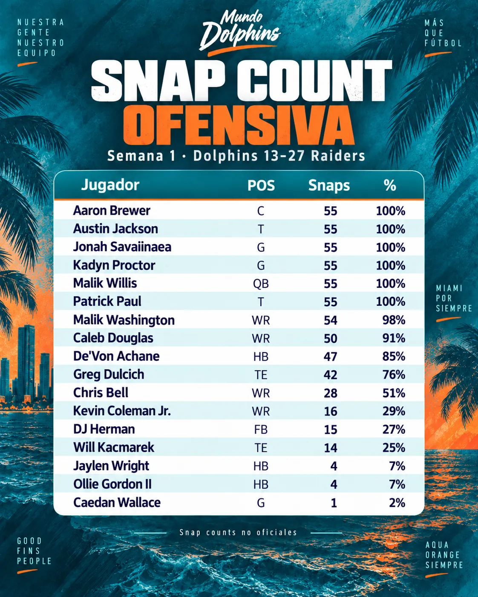
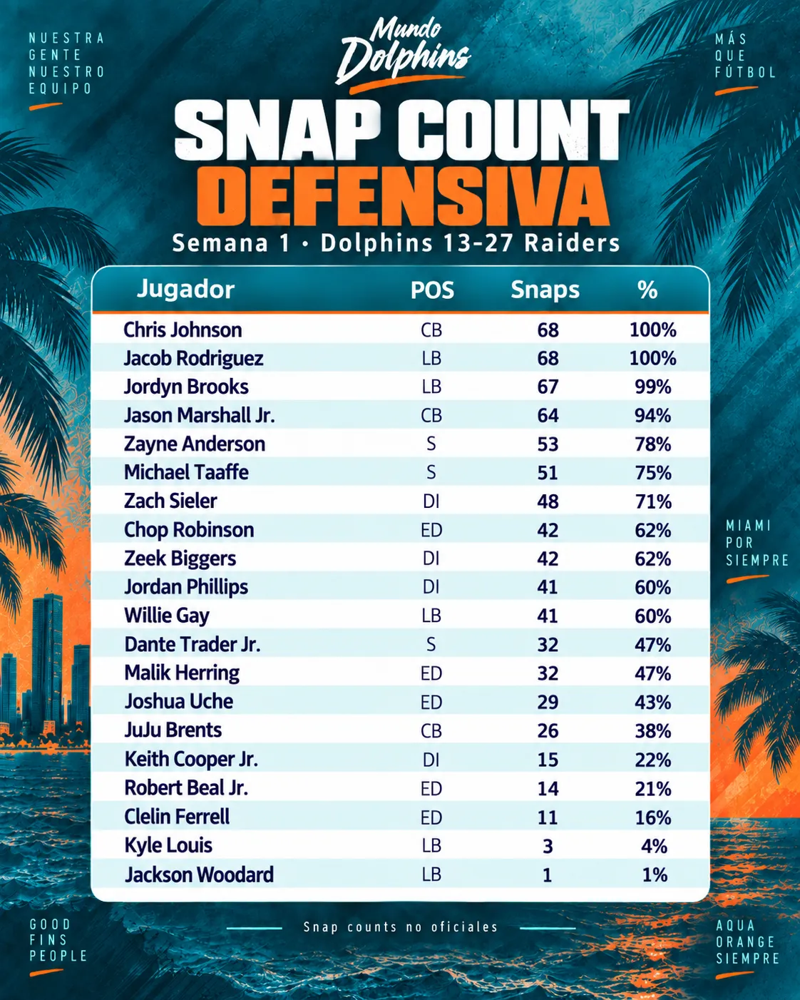

Snap counts de Miami en la derrota 13-27 ante Las Vegas.

La ofensiva disputó 55 snaps y la defensa 68. Repasamos cómo se repartieron entre titulares y rotaciones en ambos lados del balón.

---

En ataque, seis jugadores estuvieron en los 55 snaps (100%):

• Aaron Brewer
• Austin Jackson
• Jonah Savaiinaea
• Kadyn Proctor
• Patrick Paul
• Malik Willis

Es decir: QB y los cinco integrantes de la línea ofensiva jugaron todo el tiempo.

---

Entre los receptores, Malik Washington fue quien más estuvo sobre el campo: 54/55 snaps (98%).

Le siguieron:
• Caleb Douglas: 50 (91%)
• Chris Bell: 28 (51%)
• Kevin Coleman Jr.: 16 (29%)

---

En el backfield, De'Von Achane acumuló 47 snaps (85%).

El resto de RB:
• Jaylen Wright: 4 (7%)
• Ollie Gordon II: 4 (7%)

El fullback DJ Herman participó en 15 snaps (27%).

---

En tight end, el reparto fue:

• Greg Dulcich: 42 snaps (76%)
• Will Kacmarek: 14 (25%)

Caedan Wallace fue el único OL adicional que apareció en ataque, con 1 snap (2%).

---

Miami jugó 68 snaps defensivos.

Chris Johnson y Jacob Rodriguez estuvieron en los 68 (100%), mientras Jordyn Brooks disputó 67 (99%) y Jason Marshall Jr. 64 (94%).

Fueron los cuatro jugadores con mayor participación defensiva.

---

En la secundaria, además de Johnson y Marshall:

• Zayne Anderson: 53 (78%)
• Michael Taaffe: 51 (75%)
• Dante Trader Jr.: 32 (47%)
• JuJu Brents: 26 (38%)

La defensa utilizó así cuatro safeties y tres cornerbacks en distintos volúmenes.

---

En el front defensivo hubo una rotación amplia:

• Sieler 48
• Robinson 42
• Biggers 42
• Phillips 41
• Herring 32
• Uche 29
• Cooper Jr. 15
• Beal Jr. 14
• Ferrell 11

En LB: Willie Gay 41, Kyle Louis 3 y Jackson Woodard 1.

