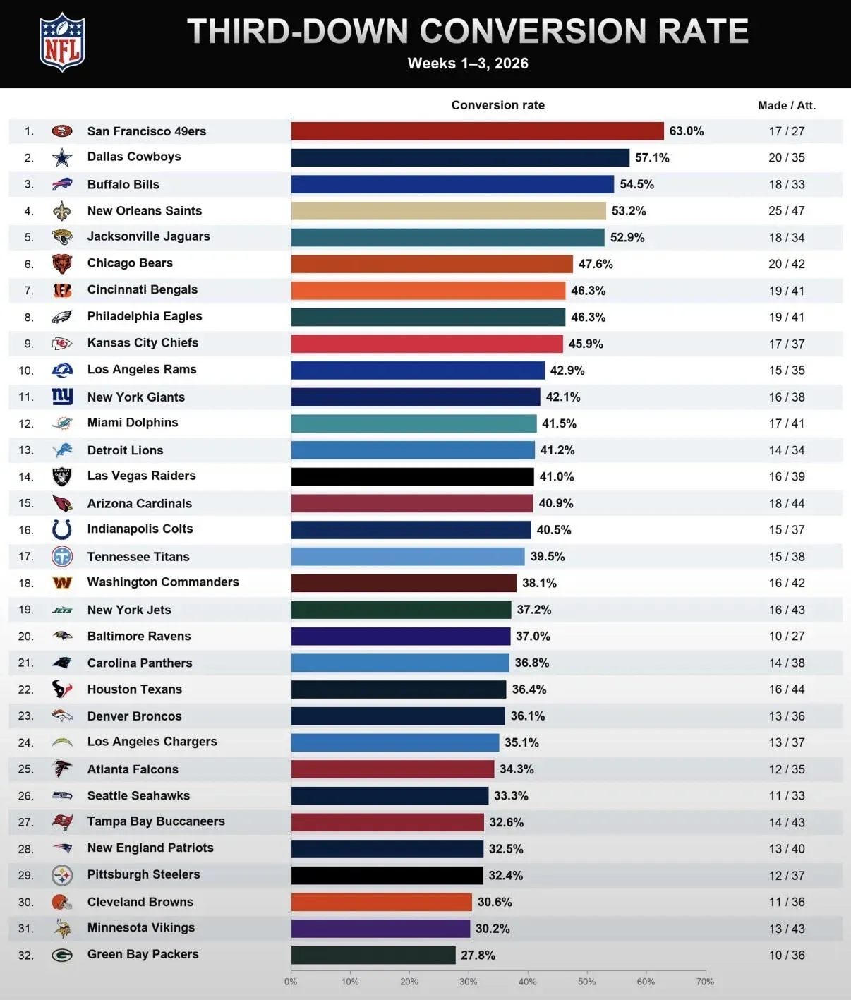

Pese al 0-3, hay áreas donde el ataque de Miami está funcionando. Tras tres jornadas, los Dolphins convierten el 41,5% de sus terceros downs (17/41), 12º mejor dato de la NFL. Minnesota, próximo rival, está penúltimo con un 30,2%.

