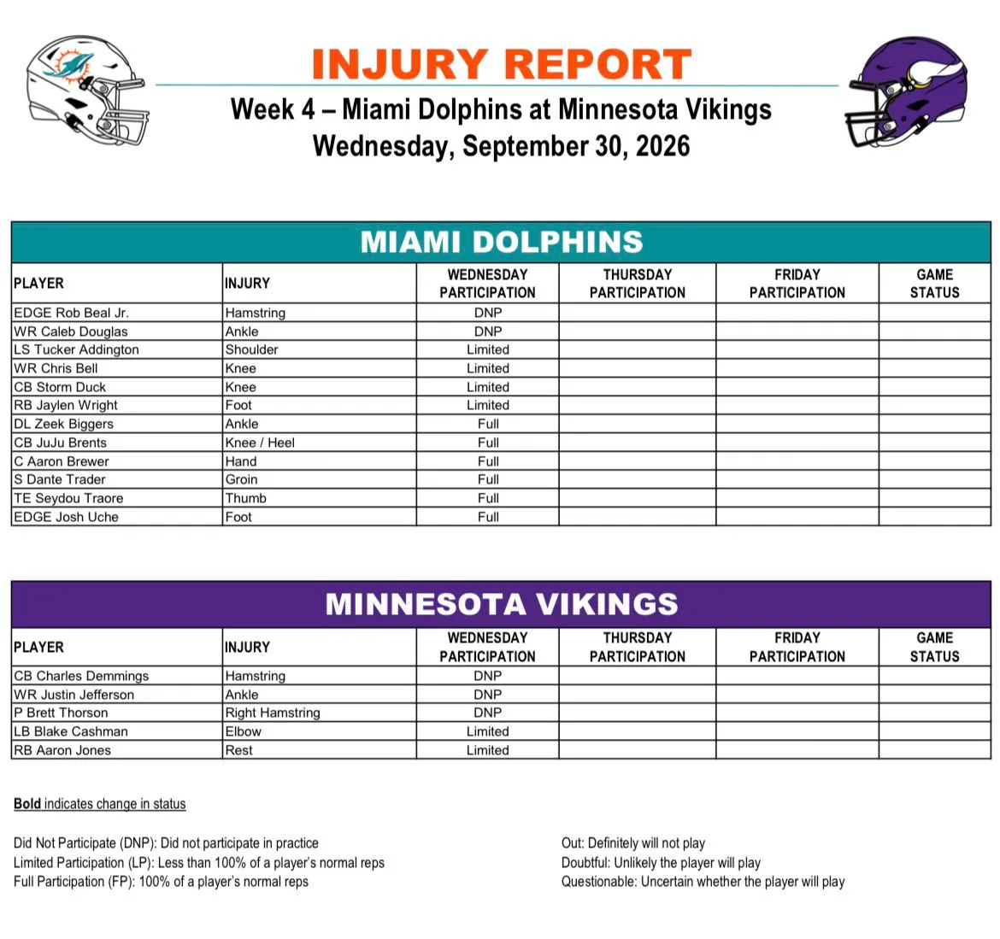

Primer injury report de la semana para Dolphins y Vikings. Todavía queda mucho hasta el domingo, pero Miami empieza la preparación de Minnesota con varios nombres a vigilar, especialmente en defensa y en el cuerpo de receptores.

---

Rob Beal Jr. no participó por un problema en el isquiotibial y Caleb Douglas tampoco entrenó por su tobillo. Son, de momento, los dos jugadores de Miami que arrancan la semana completamente fuera de la sesión.

---

Entre los limitados aparecen Tucker Addington, Chris Bell y Storm Duck, además de Jaylen Wright. El RB figura con una lesión en el pie, aunque Hafley ya había adelantado que volvería al trabajo de forma limitada.

---

La parte positiva es que varios jugadores que aparecen en el parte pudieron completar toda la sesión: Zeek Biggers, JuJu Brents, Aaron Brewer, Dante Trader, Seydou Traore y Josh Uche trabajaron sin limitaciones.

---

Minnesota también tiene nombres importantes entre algodones. Justin Jefferson no entrenó por un problema en el tobillo, mientras que Charles Demmings y el punter Brett Thorson también fueron DNP. Blake Cashman estuvo limitado.

---

Aaron Jones aparece igualmente como limitado, aunque en su caso el motivo indicado es descanso y no una lesión. Con tres días de entrenamientos por delante, habrá que ver cómo evolucionan especialmente Jefferson, Wright, Beal y el resto de ausencias.

---

Es solo el parte del miércoles y todavía no hay designaciones para el partido. Jueves y viernes irán aclarando el panorama, pero Dolphins y Vikings comienzan la semana con varios jugadores importantes cuyo progreso habrá que seguir.

