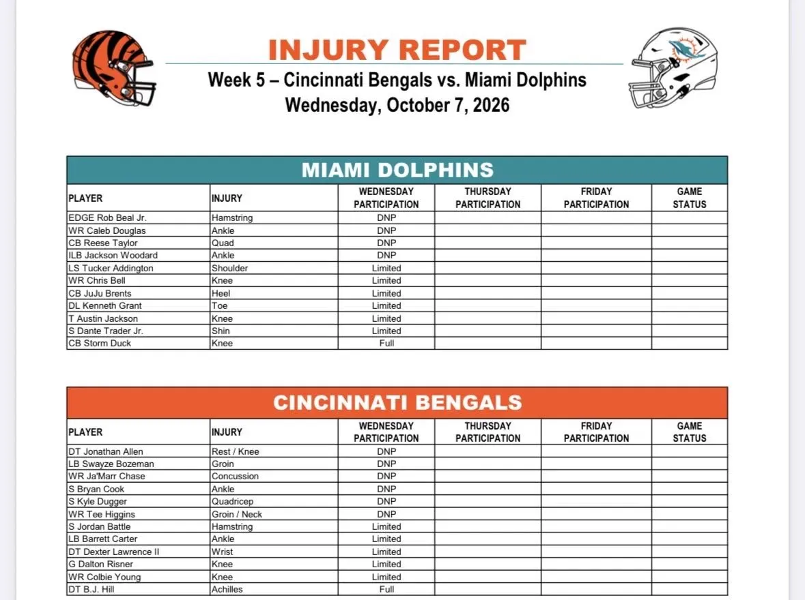

Primer injury report del Bengals @ #Dolphins

Miami tiene 4 jugadores que no entrenaron y 6 limitados. Cincinnati abre la semana con 6 DNP, entre ellos sus dos principales receptores: Ja’Marr Chase y Tee Higgins.

---

No entrenaron con Miami:

• EDGE Rob Beal Jr. hamstring 
• WR Caleb Douglas tobillo 
• CB Reese Taylor cuádriceps 
• ILB Jackson Woodard tobillo

Todavía estamos a miércoles, por lo que habrá que seguir su evolución durante la semana.

---

Kenneth Grant volvió al campo, aunque de forma limitada por el problema en el dedo del pie. También estuvo limitado Austin Jackson por la rodilla.

Hafley había confirmado hoy el regreso de Grant a los entrenamientos tras su ausencia.

---

También limitados para Miami:

• LS Tucker Addington hombro 
• WR Chris Bell rodilla 
• CB JuJu Brents talón 
• S Dante Trader Jr. espinilla

Storm Duck, incluido por una lesión de rodilla, entrenó con normalidad.

---

La noticia principal en Cincinnati está en el cuerpo de receptores.

Ja’Marr Chase no entrenó por la conmoción sufrida ante Jacksonville y Tee Higgins tampoco participó por problemas en ingle/cuello.

La disponibilidad de ambos será uno de los puntos clave de la semana.

---

Cincinnati tuvo otros cuatro DNP:

• DT Jonathan Allen descanso/rodilla 
• LB Swayze Bozeman ingle 
• S Bryan Cook tobillo 
• S Kyle Dugger cuádriceps

Una lista especialmente relevante en la secundaria de los Bengals.

---

Limitados en Cincinnati: Jordan Battle, Barrett Carter, Dexter Lawrence II, Dalton Risner y Colbie Young.

B.J. Hill entrenó por completo pese a aparecer con una lesión en el Aquiles.

