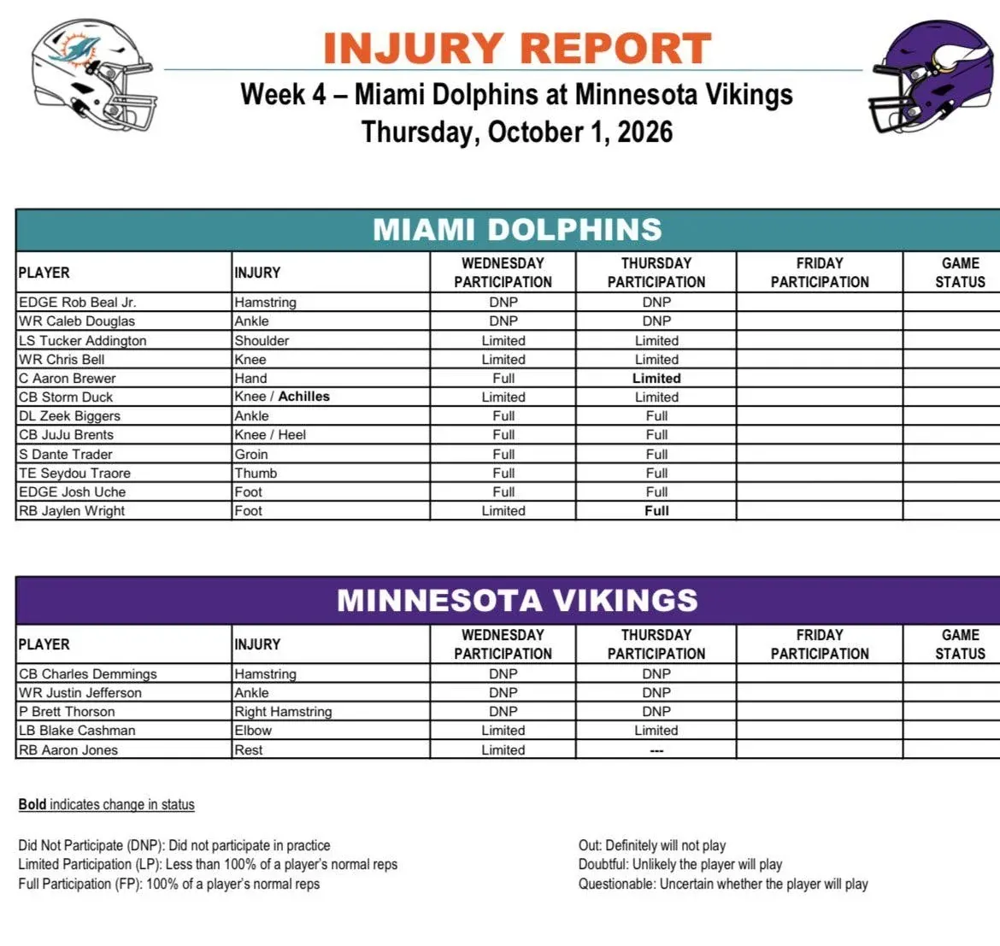

Segundo injury report de la semana y ya aparecen los primeros movimientos. La mejor noticia para Miami llega con Jaylen Wright: tras comenzar limitado por el pie, el RB pudo completar el entrenamiento del jueves.

---

Su evolución es especialmente importante tras la lesión de De’Von Achane. Wright parece avanzar en la dirección correcta para estar disponible ante Minnesota, mientras Miami prepara cómo repartirá las cargas del backfield

---

No todo fueron buenas noticias. Aaron Brewer pasó de participación completa el miércoles a limitada por su lesión en la mano. No significa necesariamente que peligre su presencia, pero será uno de los nombres a seguir en el parte definitivo del viernes.

---

Rob Beal Jr. y Caleb Douglas siguen sin poder entrenar por segundo día consecutivo. Tucker Addington, Chris Bell y Storm Duck volvieron a trabajar de forma limitada, mientras Biggers, Brents, Trader, Traore y Uche completaron la sesión.

---

En Minnesota tampoco hubo avances con Justin Jefferson, que volvió a quedarse fuera por su lesión de tobillo. Charles Demmings y Brett Thorson repitieron como DNP, mientras Blake Cashman continuó limitado.

---

Hoy llegará el reporte clave, con las designaciones para el partido. Wright ha dado un paso importante; ahora habrá que comprobar si Brewer vuelve a entrenar con normalidad y si Beal, Douglas o Jefferson consiguen regresar antes del Dolphins-Vikings

